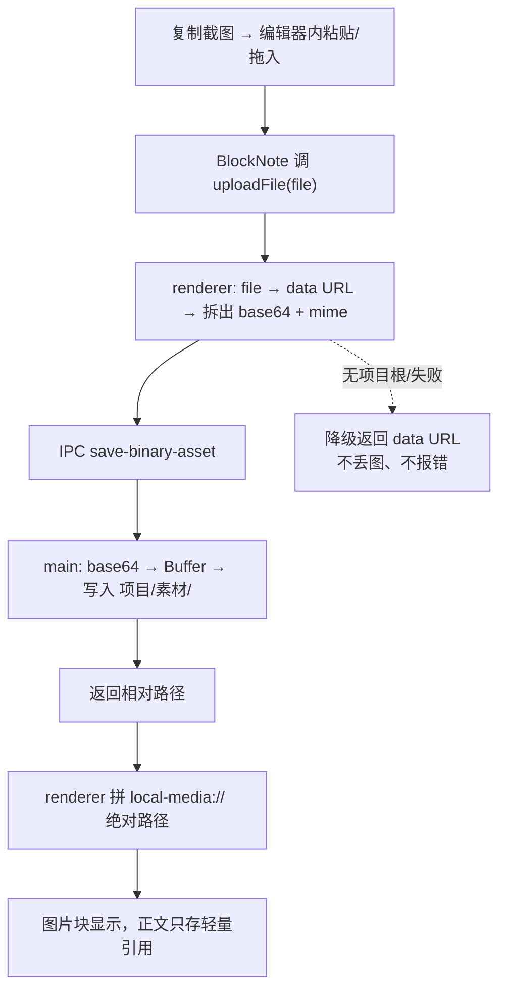

# 二进制媒体存盘与引用

让 renderer 把粘贴/拖入的图片（或其它媒体二进制）存到工作区文件系统，正文只留轻量引用，而不是把几 MB 的 base64 塞进文档。

## 为什么这么做

- **renderer 碰不到文件系统**：AGENTS.md 硬约束——渲染进程禁用 Node API，所有系统级操作必须走 IPC。所以二进制写盘只能在 main 进程做。
- **现成的文本 IPC 不能复用**：`save-local-project-file` 走的是 `utf8` 文本路径，会把二进制写坏。必须**新增**一条二进制写盘 IPC（base64 → `Buffer` → `fs.writeFile`），不要去改文本路径。
- **本地文件靠 `local-media://` 协议显示**：项目已注册 `local-media://` 自定义协议（见 `main.js` 的 `protocol.handle('local-media')`），renderer 用 `local-media://<绝对路径>` 就能加载本地图片/音视频，绕开 `file://` 跨域。这是引用本地媒体的**唯一正确方式**。
- **BlockNote 的入口是 `uploadFile`**：编辑器没配 `uploadFile` 时，粘贴的图会被默认内嵌成 base64 data URL，污染文档和 DB。配上 `uploadFile` 钩子，粘贴/拖入/插入图片都会先调它，把存盘和返回 URL 收敛到一处。

## 链路

## 步骤

1. **main 文件服务**（`apps/editor/main/localProject.js`）：新增 `saveBinaryAsset(projectRootPath, base64, mimeSubtype)`。
   - 用白名单把 mime 子类型映射到扩展名（只允许图片/媒体，**别**让任意 mime 决定后缀，防写出可执行文件）。
   - 文件名带时间戳 + 随机后缀防重名覆盖。
   - 路径**必须**经 `resolveProjectFilePath` 解析——它带越界校验，杜绝写出项目目录外。
2. **main IPC**（`apps/editor/main/main.js`）：注册 `ipcMain.handle('save-binary-asset')` 转调上面的函数；写完用 `markLocalProjectRootIgnored` + `markSavedLocalFileIgnored` 标记忽略，避免 watcher 误触发刷新。
3. **preload**（`apps/editor/main/preload.js`）：在 `electronAPI` 暴露 `saveBinaryAsset`。
4. **renderer 钩子**（`MarkdownEditor.jsx`）：给 `useCreateBlockNote` 加 `uploadFile`。
   - 用 `useRef` 持有「当前项目根」供闭包读取（`useCreateBlockNote` 的 deps 不含项目根，直接闭包会 stale）。
   - `file → FileReader.readAsDataURL → 正则拆出 base64 + mime 子类型` 这两步抽成模块级纯函数，钩子保持小。
   - 无项目根（如内置文档）或 `localProjectSupported` 为假时，**降级返回 data URL**；catch 里也降级并 `message.warning` 提示，保证绝不丢图、不抛错。

## 关键约束 / 易踩的坑

- **不要改 `save-local-project-file`**：它是文本路径，二进制必须走新 IPC。
- **`local-media://` 后面跟绝对路径**：`saveBinaryAsset` 返回的是相对项目根的路径，renderer 要拼成 `local-media://${projectRoot}/${relativePath}`。不要对整条路径用 `encodeURI`（它不编码 `#` / `?`），要保留 `/` 并对每个路径段分别 `encodeURIComponent`。
- **mime 子类型来自 data URL**：`data:image/png;base64,...` 里的 `png` 才是 mime 子类型；`jpeg` 要映射成 `.jpg`，`svg+xml` 映射成 `.svg`。
- **降级是必须的**：内置文档没有 `projectRootPath`，不降级会直接报错丢图。
- **异步上传前先固定粘贴现场**：`uploadFile` 一进入就快照当前项目根，不要在 `FileReader` / IPC `await` 之后再读 ref；粘贴图片时先在当前 ProseMirror 选区同步插入占位图片，再异步回填最终 URL。这样才不会因移动光标/切项目而插错位置、存错目录，多图也要一次占位保持顺序。
- **占位 URL 的生命周期要跨 editor 实例**：上传期间切文档会卸载原 `BlockNoteView`，只对旧 editor `updateBlock` 不会回写 store/磁盘。要保留 `fileId + blockId + pendingUrl → finalUrl` 映射，按 blockId 精确 patch 最新序列化正文并落盘，不能整篇覆盖旧快照。
- **回填不应新增 Undo 步骤**：最终 URL 回填放在 `editor.transact()` 中并设 `addToHistory=false`；同时保留 pending 映射，让用户在上传前 Undo、上传后 Redo 时仍能把恢复的占位块换成最终 URL。
- **占位内容禁止落盘和跨文档复制**：`blob:` / pending data URL 不能写进 Markdown、Notion 或剪贴到另一篇文档；上传完成前应暂停该文档落盘并在复制/粘贴时给出提示，最终 URL 回填后再保存。
- **保存与路径变更要串行**：防抖 timer 已进入 async 后 `clearTimeout` 无效，要按文件排队保存；重命名/移动/删除期间禁止用旧 fileId 新建 timer，并在路径变更后用 blockId/pendingUrl 定位新节点、把最新内容写到新路径，避免旧文件被重新创建。
- **混合附件不要半接管**：只有当剪贴板中所有 file item 都是图片时才走自定义多图链路；图片 + PDF/其它附件应交回默认 paste handler，避免非图片文件被静默丢弃。
- **遵循 `safe-change-workflow`**：定向搜索→最小改动，别碰无关模块。

## 验证

改完假定 10 条 case 给预期（粘贴 PNG/JPEG、连续多张不覆盖、拖入、内置文档降级、纯文本/代码块走原 pasteHandler 不变、base64 空/损坏降级提示、越界路径被拦、关闭重开靠 `local-media://` 重新加载）。

单测**默认不主动跑，用户要求时再跑**（`pnpm test:unit`）。注意有几个预先存在的失败（`canvas-bookmark`/`knowledge-graph-sync`/`novel-entity-extract`），用 `git stash` 对比基线确认自己零新增失败，别误判。

## 完成标准

粘贴/拖入图片自动存进工作区 `素材/`，正文只留 `local-media://` 引用；无项目根或失败时降级内嵌且有提示；现有粘贴逻辑（文本/Markdown/代码块）行为不变；零新增单测失败。
