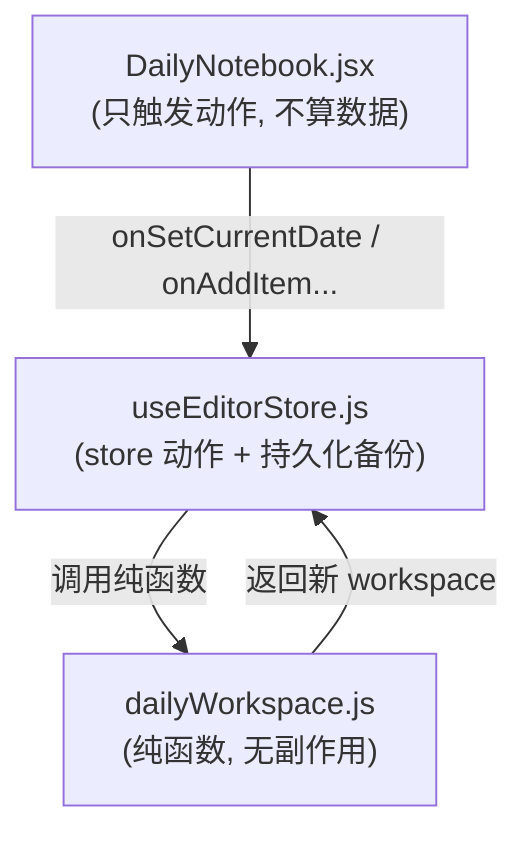

# 今日速记（Daily 速记面板）改动规范

这块的命脉是**区分两种操作语义**：翻看日期（纯视图）和跨天结转（数据迁移）。混淆这两者就会出现"切几次日期数据被重置"这类 bug。

## 模型与三层职责



- `dailyWorkspace.js`：纯函数，输入旧 workspace 返回新 workspace，**不碰 localStorage、不发 IPC**。
- `useEditorStore.js`：在 `set` 里调纯函数，再 `persistDailyWorkspaceBackup(...)` 落盘。
- `DailyNotebook.jsx`：`memo` 组件，只把用户操作转发成 store 动作，不自己算迁移逻辑。

数据形状：`{ currentDate, entries: { 'YYYY-MM-DD': { date, items[] } }, todoPool[] }`。item 有 `type`（task/event/note）、`done`、`createdAt`、`updatedAt`。

## 最关键的坑：切日期 ≠ 结转

`carryOverIncompleteTasks(ws, dateKey)` 是**破坏性**的：它会把所有 `< dateKey` 的未完成 task 扫进 `todoPool`（并从那天删掉），并把**所有早于今天、未删除的 note 全部汇聚到今天**（从原日期移走）。已完成 task、event 留在原地不动。

> 注意：note 的结转是「扫所有历史日期」而不是「只看昨天一天」。早期版本只搬 `dateKey - 1` 那天的 note，结果跳过几天 / 重装后没逐天打开就**断链**，旧笔记被卡在过去某天显示不出来。现在按文本去重、按 `createdAt` 排序后统一带到今天，幂等。

**绝不能把它绑在每次切日期上。** 用户来回翻日期只是想"看"，不是想"迁移"。一旦每次切换都跑 carryOver，来回翻几下就把当天条目搬空 —— 表现就是"数据被重置"。

正确做法：
- 手动翻日期（前后箭头、点某天）→ 用纯视图函数 `setDailyCurrentDate(ws, dateKey)`，**只改 `currentDate`**。
- 只有切到**真实今天**（`dateKey === getTodayDateKey()`，含"今天"按钮和凌晨跨天定时器）→ 才跑 `carryOverIncompleteTasks`。

store 里的判断：

```js
const nextWs = dateKey === getTodayDateKey()
  ? carryOverIncompleteTasks(state.dailyWorkspace, dateKey)
  : setDailyWorkspaceCurrentDate(state.dailyWorkspace, dateKey);
```

## 其它约定

- 改数据只走 `dailyWorkspace.js` 的纯函数，再在 store 动作里 `persistDailyWorkspaceBackup`，别在组件里直接算。
- carryOver 必须**幂等**：重复进入今天不应产生重复笔记 / 重复待办（靠 `buildTodoDedupKey` 文本去重）。
- merge（跨 session / 备份恢复）以 preferred 为准，只用 fallback 补 preferred 没有的 id，避免已删除条目"复活"。

## 验证（改代码类）

默认**不主动跑测试**，用户要求时再跑 `pnpm test:unit`（vitest）。改动后先列 10 条 case 自查，重点覆盖：
1. 切到过去日期 → 那天条目不被删
2. 切到未来日期 → 今天的未完成 task 不被搬进待办池
3. 来回切 N 次日期 → 今天条目集合不变、todoPool 不变
4. 切到真实今天 → 昨天未完成 task 进待办池
5. 已完成 task 不进待办池
6. 昨天 note 带到今天，重复进入今天不产生重复（幂等）
7. 非法日期 → 回退到原 currentDate
8. 空 workspace 进入今天 → 无害空操作

测试参考 `apps/editor/tests-unit/dailyWorkspace-switch-date.test.js`。

## 完成标准

切日期纯视图、结转只在进入今天时跑；纯函数无副作用、carryOver 幂等；10 case 自查通过，daily 相关单测全绿。
