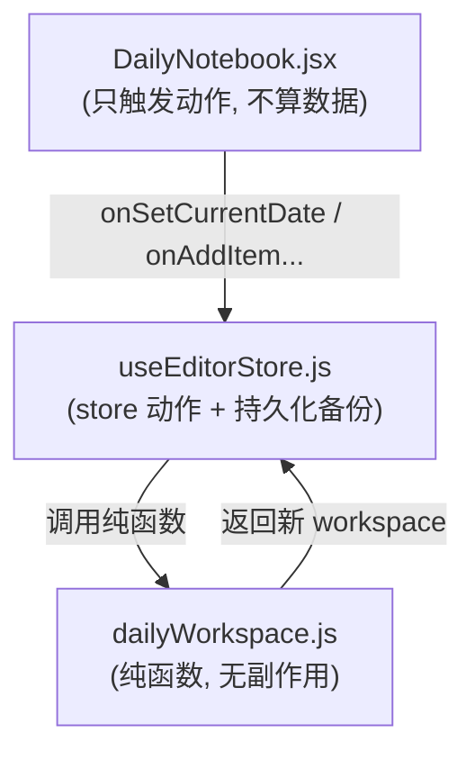

# 今日速记（Daily 速记面板）改动规范

这块的命脉是**区分两种操作语义**：翻看日期（纯视图）和跨天结转（数据迁移）。混淆这两者就会出现"切几次日期数据被重置"这类 bug。

## 模型与三层职责


```mermaid
flowchart TD
    UI["DailyNotebook.jsx<br/>(只触发动作, 不算数据)"] -->|onSetCurrentDate / onAddItem...| S["useEditorStore.js<br/>(store 动作 + 持久化备份)"]
    S -->|调用纯函数| U["dailyWorkspace.js<br/>(纯函数, 无副作用)"]
    U -->|返回新 workspace| S
```

- `dailyWorkspace.js`：纯函数，输入旧 workspace 返回新 workspace，**不碰 localStorage、不发 IPC**。
- `useEditorStore.js`：在 `set` 里调纯函数，再 `persistDailyWorkspaceBackup(...)` 落盘。
- `DailyNotebook.jsx`：`memo` 容器组件，只把用户操作转发成 store 动作，不自己算迁移逻辑。
  视图拆在 `components/daily/`：`DailyEntryList.jsx`（task/event/note 合并的单列表 + 类型筛选）、
  `DailyItemRow.jsx`（单条渲染与行内编辑）、`DailyTodoColumn.jsx`（待办池）、
  `dailyOptions.jsx`（类型/优先级/类别选项与排序比较器 `compareDailyItems`）、
  `DailyContentEditor.jsx`（正文输入区，今日记录与待办池共用）、
  `DailyRichTextEditor.jsx`（BlockNote 富文本，仅浏览器懒加载）、
  `DailyRichContent.jsx`（只读富文本渲染）。
  三种类型共用一个列表，靠类型 Tag 区分；新增类型要同时补 `DAILY_TYPE_OPTIONS` 与排序权重。

数据形状：`{ currentDate, entries: { 'YYYY-MM-DD': { date, items[] } }, todoPool[] }`。item 有 `type`（task/event/note）、`done`、`createdAt`、`updatedAt`，正文是 `text` +（可选）`richText`。

## 最关键的坑：切日期 ≠ 结转

`carryOverIncompleteTasks(ws, dateKey)` 是**破坏性**的：它会把所有 `< dateKey` 的未完成 task 扫进 `todoPool`（并从那天删掉），并把**所有早于今天、未删除的 note 全部汇聚到今天**（从原日期移走）。已完成 task、event 留在原地不动。

> 注意：note 的结转是「扫所有历史日期」而不是「只看昨天一天」。早期版本只搬 `dateKey - 1` 那天的 note，结果跳过几天 / 重装后没逐天打开就**断链**，旧笔记被卡在过去某天显示不出来。现在按文本去重、按 `createdAt` 排序后统一带到今天，幂等。

**绝不能把它绑在每次切日期上。** 用户来回翻日期只是想"看"，不是想"迁移"。一旦每次切换都跑 carryOver，来回翻几下就把当天条目搬空 —— 表现就是"数据被重置"。

正确做法：
- 手动翻日期（前后箭头、点某天）→ 用纯视图函数 `setDailyCurrentDate(ws, dateKey)`，**只改 `currentDate`**。
- 只有切到**真实今天**（`dateKey === getTodayDateKey()`，含"今天"按钮和凌晨跨天定时器）→ 才跑 `carryOverIncompleteTasks`。

store 里的判断：

```js
const nextWs = dateKey === getTodayDateKey()
  ? carryOverIncompleteTasks(state.dailyWorkspace, dateKey)
  : setDailyWorkspaceCurrentDate(state.dailyWorkspace, dateKey);
```

## 正文是富文本：`richText` 是源，`text` 是投影

条目正文有两份：

- `richText`：BlockNote 的 block 数组（段落 + 三种列表），存颜色/加粗这些 Markdown 表达不了的样式。
- `text`：由 `richText` 派生的**多行** Markdown 风格纯文本（`- ` / `1. ` / `- [ ] ` 前缀），
  给去重、carryOver、Agent 工具、导出、搜索用。

规则都收口在 `utils/dailyRichText.js`（纯函数）+ `dailyWorkspace.js` 的 `resolveContent/applyContent`：

- **有 `richText` 就以它为准**，`text` 每次归一化时重新派生 → 两者永远不会漂移。
- 单段无样式的内容**不存** `richText`（`hasRichFormatting` 判断），避免给纯文本条目白存一份结构。
- `text` 空 → 条目被丢弃（沿用原有「清空即删除」语义）。
- 搬运条目（move / sendToTodo / carryOver / promoteTodo）必须把 `richText` 一起带走，否则来回一趟格式就没了。

### 坑 1：`normalizeText` 把换行也压掉了

原来 item/todo 的 `text` 走 `String(v).replace(/\s+/g,' ')`，**`\s` 含 `\n`**，
所以哪怕 UI 让你输入了换行，落盘也会被压成一行——这就是「速记不能换行」的真正原因。
现在正文走 `normalizeContentText`（保留 `\n`，只压行内空白），
`normalizeText` 只留给 `buildTodoDedupKey` 做去重（去重就是要忽略换行差异）。

### 坑 2：单测是 node 环境，BlockNote 不能静态 import

`apps/editor/vitest.config.js` 是 `environment: 'node'`，daily 的组件测试用 `renderToStaticMarkup` 直接渲染
`DailyItemRow`（含 `isEditing` 分支）。BlockNote 的 React 层要 DOM，静态 import 会让**现有 daily 测试全挂**。

做法：`DailyRichTextEditor.jsx` 单独一个文件，`DailyContentEditor.jsx` 里用
`lazy(() => import(...))` + `canUseDOM` 守卫，没有 DOM 时渲染 `Input.TextArea` 降级。
`lazy` 不渲染就不发起 import，所以 node 路径永远碰不到 BlockNote；顺带还拿到了代码分割。

> 注意：**不要用 `React.lazy` 而不加 DOM 守卫**——`renderToStaticMarkup` 遇到未 resolve 的 lazy 会直接抛。

### 坑 3：段落可能挂子列表，别用 `<p>` 渲染

只读展示（`DailyRichContent.jsx`）按 block 结构渲染 React 元素（不走 `dangerouslySetInnerHTML`，
所以不需要 HTML 消毒，node 环境也能静态渲染）。但段落底下可以缩进出子列表，
`<ul>` 套在 `<p>` 里是非法嵌套、浏览器会自动断标签，所以段落用 `<div class="daily-rich-paragraph">`。

### 颜色

只认 BlockNote 的 9 个色名（gray/brown/red/orange/yellow/green/blue/purple/pink），
色值在 `styles.css` 里以 `--daily-rich-text-*` / `--daily-rich-bg-*` 收口，
**逐一对齐 `@blocknote/core` 的调色板**，保证「编辑时看到的」＝「保存后看到的」。
BlockNote 0.47 亮/暗共用同一套色值，所以这里也不做暗色覆盖。

## 其它约定

- 改数据只走 `dailyWorkspace.js` 的纯函数，再在 store 动作里 `persistDailyWorkspaceBackup`，别在组件里直接算。
- carryOver 必须**幂等**：重复进入今天不应产生重复笔记 / 重复待办（靠 `buildTodoDedupKey` 文本去重）。
- merge（跨 session / 备份恢复）以 preferred 为准，只用 fallback 补 preferred 没有的 id，避免已删除条目"复活"。

## 验证（改代码类）

默认**不主动跑测试**，用户要求时再跑 `pnpm test:unit`（vitest）。改动后先列 10 条 case 自查，重点覆盖：
1. 切到过去日期 → 那天条目不被删
2. 切到未来日期 → 今天的未完成 task 不被搬进待办池
3. 来回切 N 次日期 → 今天条目集合不变、todoPool 不变
4. 切到真实今天 → 昨天未完成 task 进待办池
5. 已完成 task 不进待办池
6. 昨天 note 带到今天，重复进入今天不产生重复（幂等）
7. 非法日期 → 回退到原 currentDate
8. 空 workspace 进入今天 → 无害空操作
9. 富文本条目移到待办池再取回 → `richText` 与 `text` 都还在
10. 改回纯文本 → 旧 `richText` 被清掉，不留残影

富文本相关测试参考 `apps/editor/tests-unit/daily-rich-text.test.jsx`。
schema/文档往返可以在 node 里直接验：`BlockNoteEditor.create({ schema })` 读 `editor.document`
（见 [[md-render-blocknote-core]] 的「node 里能验什么」）。

测试参考 `apps/editor/tests-unit/dailyWorkspace-switch-date.test.js`。

## 完成标准

切日期纯视图、结转只在进入今天时跑；纯函数无副作用、carryOver 幂等；10 case 自查通过，daily 相关单测全绿。
