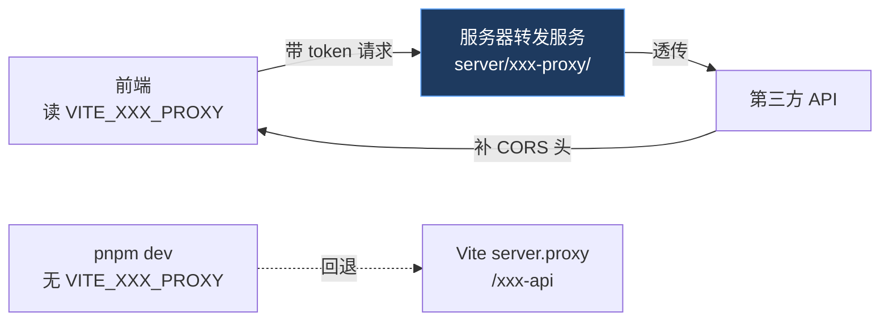

# 前端调外部 API 的代理化规范

renderer 是浏览器环境，**直连第三方 API 会被 CORS 拦截**。本项目现有做法是绕 Vite 开发代理（`vite.config.js` 的 `server.proxy`），但那个代理**只在 `pnpm dev` 存在**——打包成 Electron app 后没有了，于是功能「只在本机开发能用」。Notion 同步最初就栽在这个坑：`isLocalDevMode()` 用 hostname 判断是不是 localhost，不是就把整个面板灰掉。

正确做法：**代理地址做成可配置**，dev 走 Vite 代理，生产指向一台自己服务器上的转发服务。

## 铁律

- **CORS 是浏览器限制，服务器之间没有**。所以转发服务在服务端调外部 API、再回一个带 `Access-Control-Allow-Origin` 的响应，浏览器就放行。这是代理能解决 CORS 的根本原因。
- **代理基地址不要写死**。用 `resolveProxyBase()`：优先读 `import.meta.env.VITE_XXX_PROXY`（构建时注入），没配再回退 `/xxx-api/v1`（Vite dev 代理）。末尾统一去尾斜杠（`.replace(/\/+$/, '')`）。
- **可用性判断别用 hostname**。提供 `isXxxAvailable()`：配了代理 → 任何环境可用（含打包 app）；没配 → 回退 localhost 判断。组件层（面板 disabled、自动同步守卫）全部用它，不要再判 `localhost`。
- **token 纯透传**。转发服务只转发 `Authorization` 等白名单头，**不读取、不存储、不打印**。前端照旧带 token，代理只是借道绕 CORS。
- **生产要 HTTPS**。否则 token 明文走网络。用 Nginx/Caddy 套 TLS。

## 改动步骤（按顺序）

1. **转发服务**：`server/<name>-proxy/server.js`，零依赖 Node（`http` + `https`），透传 `/v1/*`、处理 `OPTIONS` 预检、补 CORS 头、非 `/v1` 返回 404。配 `README.md`（Node 启动 + Nginx 反代两种部署）。
2. **前端 service**：`NOTION_PROXY_BASE` 这类常量改成 `resolveProxyBase()`；`isLocalDevMode` 改成 `isXxxAvailable`。其余请求函数不动（都是 `${base}/...` 拼接，相对/绝对地址都成立）。
3. **组件层**：把 `dev` / `xxxLocalDev` 判断换成 `isXxxAvailable()`，更新过时的提示文案（指向 `server/<name>-proxy/README.md` 和 `VITE_XXX_PROXY`）。
4. **配置**：`apps/editor/.env.example` 加 `VITE_XXX_PROXY` 说明（末尾 `/v1`、不带尾斜杠、生产用 https）。确认 `.gitignore` 已忽略 `.env`。
5. **单测**：`pnpm test:unit`，确认相关转换/解析测试不受影响。注意项目里有几个**预先存在的失败**（novel-entity-extract / knowledge-graph-sync / canvas-bookmark），与本类改动无关，别误判成自己引入——可 stash 改动重跑那几个文件确认。

## 易漏点

- 改 service 里 `isLocalDevMode` → `isXxxAvailable` 后，**所有引用点都要跟着改**（NotionPanel 的多处 `disabled={!dev}`、MarkdownEditor 的自动同步守卫 + useCallback 依赖数组）。漏一处 hook 依赖会触发 lint/行为不一致。
- 转发服务的 `path` 直接用 `req.url`（已含 `/v1/...`，外部 API 正是 `/v1` 前缀），别再拼一次。
- 别给转发服务加多余请求头转发，白名单只留 `authorization` / `notion-version`（或对应 API 的版本头）/ `content-type`。

## 参考实现

Notion 代理是完整范例：`server/notion-proxy/server.js` + `README.md`（转发服务）、`notionService.js` 的 `resolveProxyBase` / `isNotionAvailable`、`apps/editor/.env.example` 的 `VITE_NOTION_PROXY`。改动遵循 [[safe-change-workflow]]；这类条目若同时是知识库来源，见 [[md-render-kb-source]]；提交前敏感信息扫描见 [[pre-commit-secrets]]。
