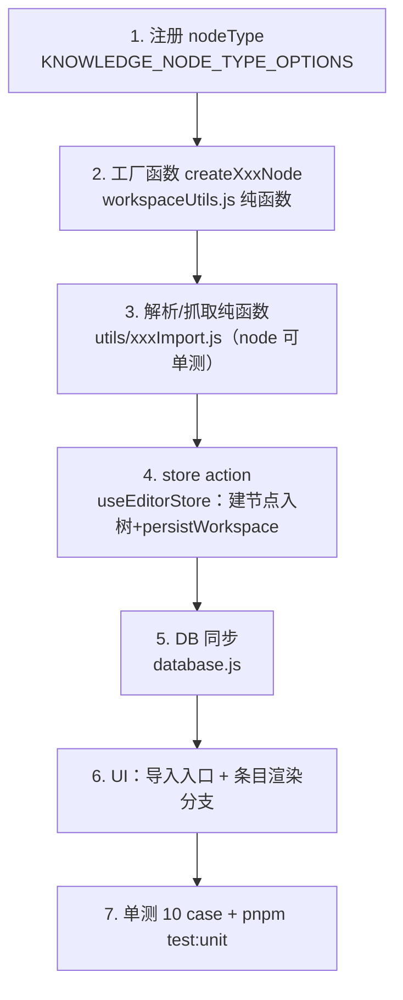

# 知识库新增节点类型 / 外部来源规范

知识库的条目（文档、书签、概念……）**全部复用 `file` 节点**，用 `nodeType` 区分种类，不另起新结构。它们落在 SQLite `documents` 表并由 FTS5 索引。新增一种类型/来源最常见的漏步是：加了 nodeType 却忘了在 `KNOWLEDGE_NODE_TYPE_OPTIONS` 注册（于是 `normalizeNodeType` 把它打回 `document`），或给节点加了字段却没同步进 DB 的 flatten/upsert/迁移。

## 数据模型铁律

- **节点 = file**：`{ id, type:'file', name, nodeType, content, summary, tags, aliases, relatedIds, createdAt, updatedAt, ...自定义字段 }`。
- **nodeType 必须注册**：任何新 `nodeType` 先加进 `workspaceUtils.js` 的 `KNOWLEDGE_NODE_TYPE_OPTIONS`，否则 `normalizeNodeType` / `ensureKnowledgeFields` 会在每次 hydrate 时把它重置成 `document`，自定义字段也可能在 `{...node, ...createDefaultKnowledgeFields(node)}` 中保不住（spread 顺序：node 在前，自定义字段会保留，但 nodeType 必须合法）。
- **搜索靠 FTS 已索引的列**：`documents_fts` 只索引 `name, content, summary, aliases, tags`。新字段（如 url）**默认搜不到**——要么把内容塞进上述某列，要么接受「只用标题/标签可搜」。给 FTS 加新列需重建虚拟表+三个触发器，成本高，非必要别做。
- **纯函数放 workspaceUtils.js**：建节点的工厂函数（如 `createBookmarkNode`）写成纯函数放这里，详见 [[md-render-store]]。

## 新增一种来源的步骤（按顺序，缺一不可）

1. **注册 nodeType**：`KNOWLEDGE_NODE_TYPE_OPTIONS` 加 `{ value, label }`。
2. **工厂函数**：`createXxxNode()` 纯函数，返回 file 节点；自定义字段（如 `url`）直接挂在节点上。
3. **解析纯函数**：放 `renderer/src/utils/`，**不要依赖 DOM**——vitest 环境是 `node`（见 `vitest.config.js`），`DOMParser` 不可用。解析 HTML 用正则状态机，不用 DOMParser。
4. **store action**：在 `useEditorStore` 加 action，用 `addChildNode` 入树、`persistWorkspace(next)` 落盘、`set(...)`。自动建归类目录时打自定义标记字段（如 `bookmarkFolder:true`）以便复用时定位，而不是靠目录名匹配。
5. **DB 同步**（`apps/editor/main/database.js`）——新增字段要改 **4 处**：
   - `SCHEMA` 的 `CREATE TABLE documents` 加列（新库）；
   - `initDatabase` 里加一行 `try { db.exec('ALTER TABLE documents ADD COLUMN xxx TEXT'); } catch {}`（老库迁移，仿 `disk_path` / `url`）；
   - `flattenWorkspace` 的 push 对象带上该字段；
   - `syncDocuments` 的 `upsert` SQL 列名 + `VALUES` 占位符都要加。
6. **UI**：导入入口（弹窗 modal 放在 `MarkdownEditor` 底部、状态用 `useState`）；条目渲染——若该类型不该用 BlockNote 编辑器，在 `MarkdownEditor` 的 paper 分支按 `selectedFile?.nodeType === 'xxx'` 分流到专用卡片组件。
7. **样式**用 `design-tokens.css` 的 CSS 变量（`--color-bg-surface` / `--color-border` / `--color-text-primary` 等），不硬编码颜色。

## 打开外链

渲染进程里 `window.open(url, '_blank')` 即可——main 进程已设 `setWindowOpenHandler` → `shell.openExternal` 转交系统浏览器；web 端开新标签页。**不需要新增 IPC**。

## 参考实现

书签导入是完整范例：`utils/bookmarkImport.js`（解析）+ `createBookmarkNode`（工厂）+ `importBookmarks`（store）+ `BookmarkImportModal`/`BookmarkCard`（UI）+ `tests/bookmark-import.test.js`（单测）。改动遵循 [[safe-change-workflow]]。
