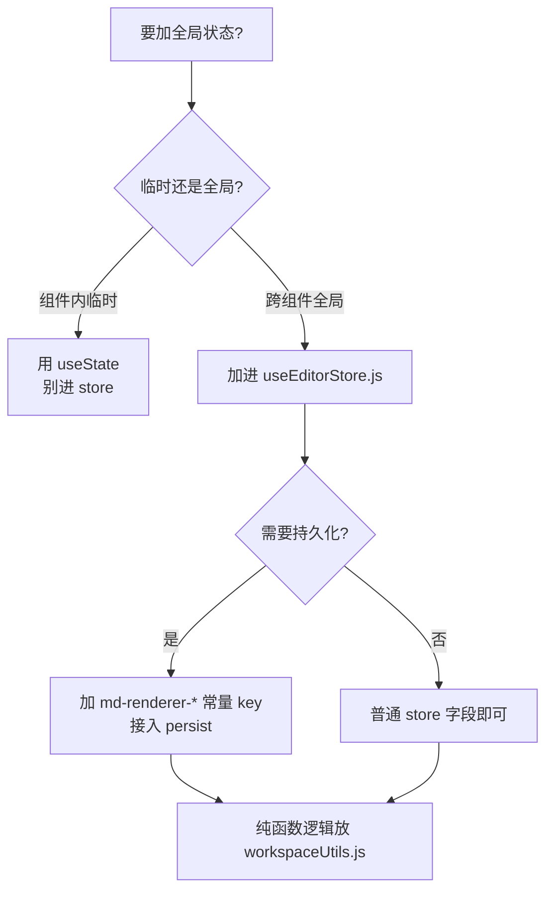

# 全局状态改动规范

这个项目所有全局状态集中在一个 zustand store。新增状态最常见的错误是另起一个 store 或直接碰 localStorage，导致状态分散、持久化失控。这个 skill 固化正确做法。

## 核心约定



1. **唯一全局 store**：`src/store/useEditorStore.js`（zustand `create` + `persist`）。**绝不新建第二个全局 store**。
2. **临时状态用 `useState`**：只在单个组件内用的状态，留在组件里，不要污染全局 store。
3. **持久化 key 用常量**：所有 storage key 在 store 文件顶部定义为 `UPPER_SNAKE_CASE` 常量，命名前缀统一是 `md-renderer-`，例如 `const FOO_STORAGE_KEY = 'md-renderer-foo';`。不要散写字符串字面量。
4. **不直接碰 localStorage**：持久化统一走 store 现有的 persist 机制（项目用的是兼容多 key 的自定义 storage）。组件里不要出现 `localStorage.getItem/setItem`。
5. **纯函数工具放 `workspaceUtils.js`**：工作区相关的纯计算（查找节点、生成唯一名、增删节点等）放这里，例如 `findNodeById`、`buildUniqueName`、`addChildNode`。store 里只放状态和 action，复杂纯逻辑抽出去复用。

## 新增一个全局状态字段的步骤

1. 在 store 顶部确认/新增对应的 `*_STORAGE_KEY` 常量（仅当需要持久化）。命名走 `md-renderer-` 前缀。
2. 在 store 的 state 里加字段，给合理默认值。
3. 加对应的 action（`set`/`update`/`toggle` 等），保持 action 小而单一职责。
4. 如果涉及复杂的纯计算，写成纯函数放 `workspaceUtils.js` 并 import 进来，不要把大段逻辑塞进 action。
5. 组件里通过 `const { foo, setFoo } = useEditorStore();` 读写，不绕过 store。

## 在组件里用

```javascript
// ✅ 读写全局状态
const { markdown, setMarkdown, theme } = useEditorStore();

// ✅ 纯函数工具从 workspaceUtils 引
import { findNodeById, buildUniqueName } from '../store/workspaceUtils.js';

// ❌ 不要新建 store，不要直接 localStorage
```

## 验证

默认不要主动执行测试命令，先列建议验证项。用户明确要求跑测试时，再执行最小范围的 `pnpm test:unit` 或用户指定命令。

如果新增/修改了 `workspaceUtils.js` 的纯函数，可以建议补对应单测（这些纯函数最好测，输入输出确定）。列几条 case 覆盖：默认值、设置后读取、持久化往返（写入再读出一致）、边界输入。

## 完成标准

- 状态加在唯一的 useEditorStore，没有新 store
- 持久化 key 是 md-renderer-* 常量，没有裸字符串
- 没有组件直接操作 localStorage
- 纯逻辑放在 workspaceUtils.js 且有单测
- 已列出建议验证项；如用户要求跑测试，再说明测试结果
