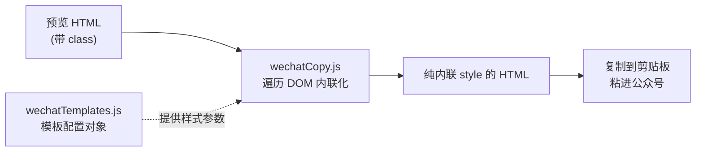

# 微信公众号格式化规范

微信公众号编辑器有个硬约束：**粘贴进去的内容只认内联 style，不认 class 和外部 CSS**。所以这套格式化的本质是"把渲染好的 HTML 遍历一遍，按模板把样式逐个写成内联 style"。理解这一点，改动就不会走偏。

## 两个文件的职责

- **wechatTemplates.js**：定义模板。每个模板是一个**配置对象**，形如 `{ id, name, base, linkColor, borderColor, headingBorderColor, spacing, ... }`。模板之间可共用片段（如 `sharedStatement`、`autoGuide`）。这里只放"样式参数"，不放转换逻辑。
- **wechatCopy.js**：转换逻辑。遍历渲染后的 DOM，按当前模板把每类元素（标题、段落、代码块、行内码、图片、表格、引用、链接、hr、加粗、斜体……）逐个设置**内联 style**。这里只放"怎么应用样式"，不放模板数据。

数据（模板）和逻辑（应用）分离——加新模板改 templates，改某类元素的处理方式改 copy。别混。

## 加一个新排版模板的步骤

1. 在 `wechatTemplates.js` 复制一个现有模板对象（如 `defaultSimple`）作为起点。
2. 改 `id`（唯一）、`name`（展示名），调整 `base`（fontSize/lineHeight/color/backgroundColor）、`linkColor`、各种 `borderColor`、`spacing` 等参数。
3. 共用片段（声明块、引导语）直接复用现有常量，不要重复定义。
4. 把新模板加进模板导出列表（`TEMPLATES`），确保 UI 能选到。
5. **不用动 wechatCopy.js**——只要新模板提供了 copy 逻辑读取的那些字段，转换会自动套用。如果发现某字段 copy 里没用上，说明要么字段名写错，要么这是个新维度，需要在 copy 里加对应处理。

## 改某类元素的样式处理

如果是"所有模板下某类元素都要改处理方式"（比如代码块换行策略、表格边框画法），改 `wechatCopy.js` 里对应的遍历块（`codeBlocks.forEach`、`tables.forEach`、`headings.forEach` 等）。改完确认所有模板都还正常。

## 关键约束

- **只能内联 style**：不能依赖 class 或 `<style>` 标签，微信会丢弃。
- **颜色等具体值在模板里**：copy 逻辑从模板对象取值，不在 copy 里硬编码颜色。
- **保持纯粹**：转换函数尽量无副作用，输入 HTML + 模板 → 输出内联化 HTML。

## 验证

默认不要主动执行测试命令。先列 case 覆盖各类元素，逐条检查内联 style 是否正确；用户明确要求跑测试时，再执行最小范围的 `pnpm test:unit` 或用户指定命令：

1. 标题 h1-h6（字号/边框是否按模板）
2. 段落（间距、颜色）
3. 代码块 + 行内码
4. 有序/无序列表
5. 表格（表头、单元格边框）
6. 引用块
7. 链接（颜色）
8. 加粗 / 斜体
9. 图片
10. 分隔线 hr + 末尾声明/引导语

最可靠的人工验证：把转换结果实际粘进公众号编辑器看效果，确认没有依赖 class 而丢样式。

## 完成标准

- 新模板只动 templates，逻辑只动 copy，没混在一起
- 产出是纯内联 style，无 class 依赖
- 颜色等值来自模板对象，未硬编码
- 已列出建议验证项；如用户要求跑测试，再说明测试结果
