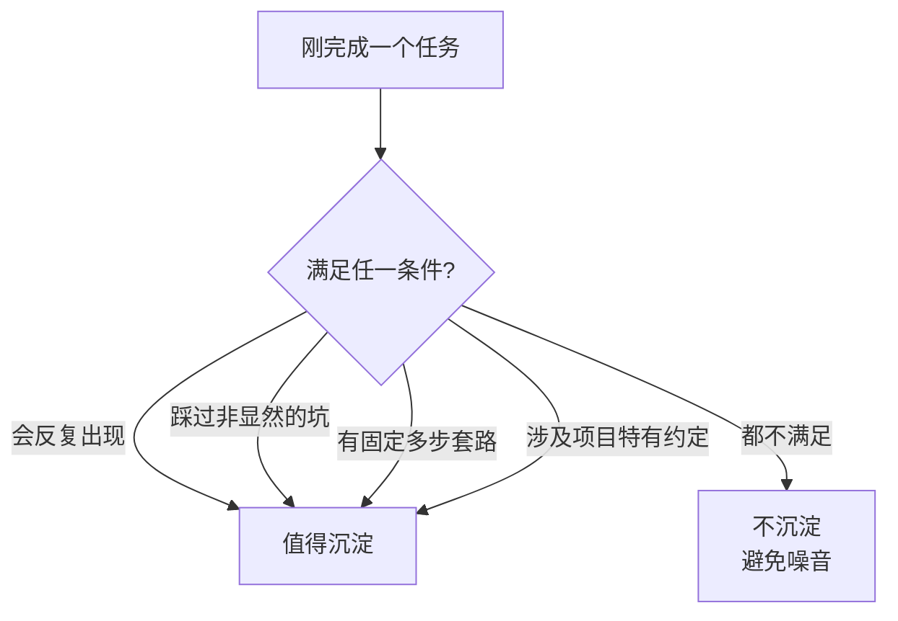

# Skill 沉淀器

这个项目想"在开发过程中不断沉淀有价值的 skill"。这个 skill 就是那个让沉淀机制持续运转的引擎：每完成一段有套路的工作，停下来判断它值不值得固化，值得就按统一规范生成。

## 什么时候该沉淀（判断标准）

不是所有任务都值得做成 skill。满足下面任意一条，才考虑沉淀：



- **会反复出现**：这类任务以后还会做很多次（如"加一种 Markdown 语法"）。
- **踩过非显然的坑**：过程中发现了不看代码就想不到的陷阱（如"微信只认内联 style")。
- **有固定多步套路**：步骤明确且容易漏掉某步（如"列 10 case + 只在用户要求时跑测试")。
- **涉及项目特有约定**：和这个项目的结构强绑定（如"全局状态只走 useEditorStore")。

反过来，**不要沉淀**：一次性的任务、纯通用常识、AGENTS.md 已经写清楚的静态规范（除非要把它变成可执行流程）。沉淀过多会稀释信噪比，让真正有用的 skill 不容易被触发。

## 沉淀前先查重

生成新 skill 前，先扫一遍 `.Codex/skills/` 看有没有已存在的。如果只是已有 skill 的补充，**优先改那个 skill** 而不是新建——避免职责重叠的 skill 互相打架。

## 生成步骤

1. **提炼意图**：从刚完成的任务里抽出——这个 skill 让 Codex 能做什么、什么情况下该触发、产出是什么。优先从对话历史里找答案（用了哪些工具、步骤顺序、用户做过哪些纠正）。
2. **建目录**：`.Codex/skills/<kebab-case-name>/SKILL.md`。名字用小写连字符，能见名知意。
3. **写 frontmatter**：
   - `name`：和目录名一致。
   - `description`：**最关键**，决定触发准确率。要同时写清"做什么"和"什么时候用"，并列出会触发的用户说法。略微"主动"一点，因为 skill 容易该触发时不触发。所有"何时用"的信息都放这里，不要放正文。
4. **写正文**：用祈使句。**解释为什么**这么做（说人话，别堆术语），而不是干巴巴列 MUST。复杂流程配一张 Mermaid 图（暗黑主题清晰、语法可渲染——参考 `mermaid-verify` skill）。给出步骤、关键约束、验证方法。
5. **本项目惯例**：涉及改代码的 skill，正文里带上"默认不主动跑测试，用户要求时才跑""列 10 条 case 验证"这类项目硬约定。

## SKILL.md 模板

```markdown
---
name: 技能名-kebab-case
description: 做什么 + 什么时候触发（列出用户会说的话）。略主动。
---

# 技能名

一句话说清这个 skill 解决什么问题。

## 为什么这么做
解释背后的原因（说人话）。

## 步骤
（复杂流程配 Mermaid 图，自检可渲染、暗色清晰）

## 关键约束 / 易踩的坑

## 验证
（改代码类：列 10 case；用户明确要求时再跑测试）

## 完成标准
```

## 写完自检

- frontmatter 的 `name` 和目录名一致，`description` 写清了触发场景
- 正文解释了"为什么"，不是纯命令堆砌
- 有 Mermaid 图的，语法可渲染、暗色清晰（见 `mermaid-verify`）
- 没和已有 skill 职责重叠
- 简洁，不过度设计——和这个项目的整体风格一致

## 完成标准

判断结论明确（沉淀 / 不沉淀，给理由）；决定沉淀时，产出一个符合上述规范、放在 `.Codex/skills/` 下的 SKILL.md。
