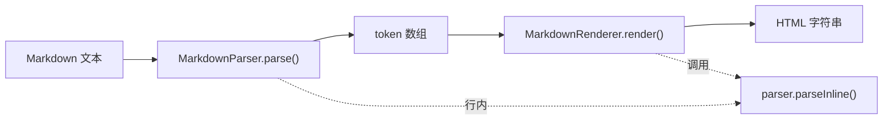
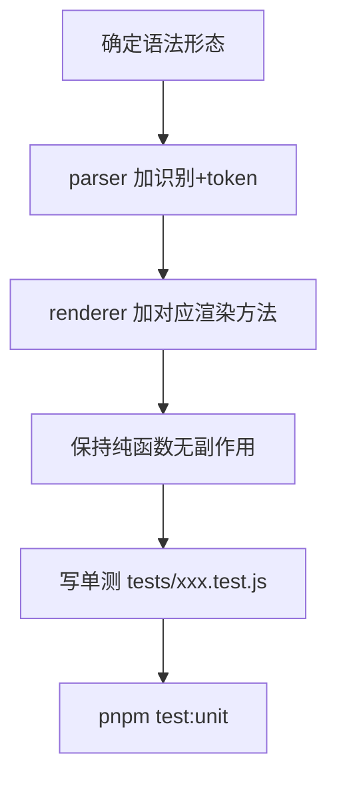

# 解析 / 渲染改动规范

`parser.js` 和 `renderer.js` 是这个项目的命脉：所有 Markdown 文本最终都经过它们变成预览 HTML。改这里要格外小心，因为微信格式化、Notion 导出等下游都依赖它们的输出。

## 两个模块的职责



- **parser.js**：`MarkdownParser` class，`parse(text)` 把文本切成 **token 数组**，纯函数无副作用。行内标记（粗体、链接等）由 `parseInline(content)` 处理。
- **renderer.js**：`MarkdownRenderer` class，`render(tokens)` 把 token 数组拼成 **HTML 字符串**，纯函数无副作用。渲染行内内容时调用 `this.parser.parseInline()`。

## 现有 token 类型

`renderToken()` 的 switch 覆盖这些 type，新增语法要么复用、要么新增一类：

```
empty | hr | paragraph | heading | code-block | list | blockquote | table
```

每个 token 由 `withMeta()` 统一附加元信息：`id`（`block-N`）、`source`（原始文本）、`startLine`、`endLine`。**新增 token 时不要绕过 `withMeta`**，否则下游依赖这些字段的逻辑会出问题。

## 新增一种语法的标准步骤



1. **在 parser 中识别并产出 token**。在 `parse()` 的 while 循环里加分支识别新语法（块级），或在 `parseInline()` 里加行内规则。块级 token 必须经过 `withMeta()`。给 token 起清晰的 `type` 名。
2. **在 renderer 中加渲染**。在 `renderToken()` 的 switch 加 `case`，写对应的 `renderXxx(token)` 方法。行内内容用 `this.parser.parseInline()` 处理，不要自己重写行内解析。
3. **保持纯函数**。两个模块都不能有副作用——不读写全局、不操作 DOM、不依赖外部可变状态。相同输入永远相同输出。
4. **HTML 输出注意转义**。文本内容要正确转义 `<`、`>`、`&`，避免 XSS 和渲染错乱。参考现有 `renderParagraph`/`renderHeading` 的处理方式。
5. **样式走 CSS class**。渲染出的 HTML 用 class，颜色等在 `design-tokens.css` / `styles.css` 里定义，不在 HTML 里硬编码颜色。

## 改动前必读

动手前完整读懂 `parser.js` 和 `renderer.js` 的现有结构，特别是：`withMeta` 怎么用、`parseInline` 支持哪些行内标记、list/table/blockquote 这类嵌套结构怎么处理。不看懂就改，很容易破坏嵌套或元信息。

## 验证（10 条 case）

改完列至少 10 条输入并给出预期 HTML，覆盖：

1. 新语法的标准用法
2. 新语法 + 行内标记组合（如新块里含粗体/链接）
3. 空内容 / 只有标记没内容
4. 与相邻块的边界（前后接空行、接其他块）
5. 嵌套场景（如果适用）
6. 特殊字符需转义（`<`、`&`、`"`）
7. 超长内容
8. 不完整/畸形输入（缺闭合标记）
9. 与已有语法易混淆的输入
10. 多个新语法块连续出现

然后 **必须跑 `pnpm test:unit`**，并为新语法补对应单测文件 `tests/<feature>.test.js`（vitest）。注意：`*.test.js` 是 vitest 单测，`*.spec.js` 是 playwright E2E，别放错。

## 完成标准

- parser 产出的 token 经过 withMeta，type 命名清晰
- renderer 有对应 case + renderXxx 方法
- 两模块仍是纯函数，HTML 已正确转义
- 补了单测，`pnpm test:unit` 通过
