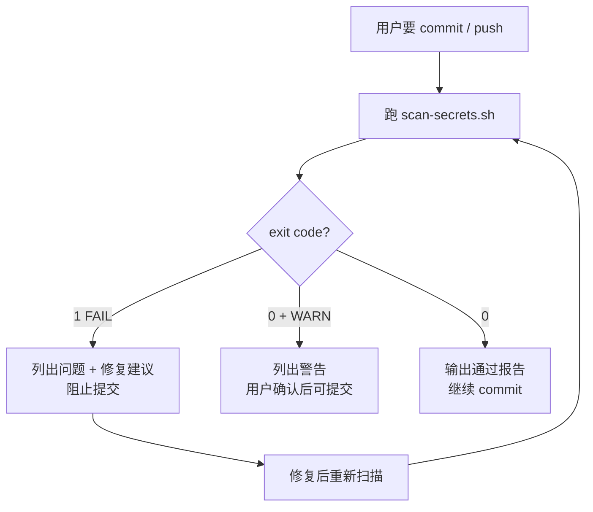

# 提交前敏感信息检查

每次 git commit / push 前，先确认变更里没有密钥、凭证或不该进仓库的文件。漏检一次就可能把 Notion token、GitHub PAT 等永久写进历史。

## 为什么这么做

- 密钥进 git 历史后，即使后续删除文件也仍可从历史恢复。
- 本项目有 **Notion Integration Secret**（用户输入存 localStorage），以及 Electron 构建产物，都容易误提交。
- 自动化扫描 + 人工确认，比凭感觉 commit 可靠。

## 流程



## 步骤

### 1. 确定扫描范围

| 场景 | 命令 |
|------|------|
| 即将 commit（默认） | `bash .claude/skills/pre-commit-secrets/scripts/scan-secrets.sh --staged` |
| 工作区全部变更 | `bash .claude/skills/pre-commit-secrets/scripts/scan-secrets.sh --working` |
| 全仓库审计 | `bash .claude/skills/pre-commit-secrets/scripts/scan-secrets.sh --all` |

### 2. 执行脚本并解读结果

- **FAIL（exit 1）**：必须修复后才能提交。
- **WARN**：可能是误报，逐条人工确认；确认安全才可提交。
- **OK**：可继续 commit。

### 3. 补充人工检查（脚本覆盖不到的）

- `git diff --cached` 目视扫一遍：有没有调试用的真实 token、个人路径、内网 URL。
- 新增 JSON / 测试 fixture 里是否夹带了用户数据。
- Electron 相关：`dist-electron/`、`release/` 必须在 `.gitignore` 且未 staged。

### 4. 输出报告模板

```markdown
## 敏感信息扫描报告

**范围**: staged / working / all
**结果**: ✅ 通过 | ⚠️ 有警告 | ❌ 阻断

### 发现项
- （无则写「未发现」）

### 本项目说明
- Notion token：仅存浏览器 localStorage（`md-renderer-notion-token`），不应出现在源码
- `.env` / `.env.local`：已在 .gitignore，禁止提交

### 建议
- （FAIL 时写具体修复步骤）
```

## 本项目敏感面清单

| 类型 | 位置 | 风险 |
|------|------|------|
| Notion Integration Secret | 用户输入 → localStorage | 误写进测试/fixture/日志 |
| `.env` / `.env.local` | 项目根 | 已在 .gitignore，勿 force-add |
| 构建产物 | `dist-electron/`, `release/`, `build/` | 已在 .gitignore，勿提交 |
| GitHub PAT | 若用于 CI/脚本 | `ghp_` / `github_pat_` 前缀 |
| 私钥/证书 | `*.pem`, `*.key` | 禁止进仓库 |

## 常见误报（不要当 FAIL）

- Markdown/parser 语境下的 `token`（`parser.js`、`renderer.js` 的 token 数组）
- `design-tokens.css`、`js-tokens` 等 npm 包名
- `NotionPanel.jsx` 里 `type="password"`、`placeholder="secret_…"`（UI 占位，非真实密钥）
- GitHub Actions 的 `id-token: write`（OIDC 权限，非 secret）

## 泄露后的处理

若密钥**已经 commit 但未 push**：

1. 从变更中移除敏感内容
2. 用新 commit 修复（不要 amend 已 push 的 commit）
3. **立即轮换/作废**已泄露的密钥（Notion 里重新生成 Integration Secret）

若**已经 push**：

1. 轮换密钥（优先）
2. 再考虑 `git filter-repo` / BFG 清理历史（需与用户确认，操作 git 前先询问）

## 与 commit 流程的关系

用户要求 commit 时：

1. **先**跑 `--staged` 扫描
2. 通过或确认 WARN 后，再 `git add` / `git commit`
3. 用户规则要求「操作 git 前先询问」——扫描报告一并呈现，等用户确认再 commit

## 完成标准

- 扫描脚本已执行，exit code 和发现项已报告
- FAIL 项已给出修复建议，未在 FAIL 状态下提交
- 全仓库审计时，额外说明 git 历史中是否检出过高置信度模式
