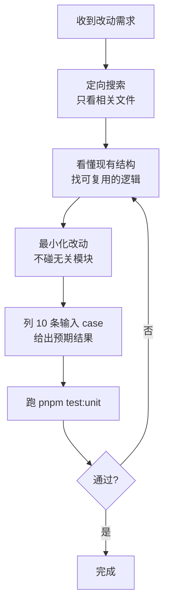

# 安全改动流程

这个 skill 把"改动前想清楚、改动后验证到位"固化成可执行的步骤。目的是避免两类常见问题：改之前没看懂现有代码导致改错地方，改之后没验证导致引入回归。

## 为什么这么做

代码改动的风险大多来自两个盲区：一是没看全相关代码就动手，把本来能复用的逻辑重写了一遍，或者破坏了别处依赖；二是改完凭感觉觉得"应该对"，没有真正验证边界情况。这个流程用最小成本堵住这两个盲区。

## 执行步骤



### 1. 定向搜索，只看相关文件

先用 Grep/Glob 定位到真正相关的文件，不要一上来全量读。明确忽略：`pnpm-lock.yaml`、`dist/`、`node_modules/`、其他构建产物。

入口对照（来自项目 CLAUDE.md）：

| 需求 | 看这里 |
|------|--------|
| 编辑器主逻辑 | `apps/editor/renderer/src/components/MarkdownEditor.jsx` |
| 全局状态 | `apps/editor/renderer/src/store/useEditorStore.js` |
| Electron 主进程 | `apps/editor/main/main.js` + `preload.js` |
| 解析/渲染 | `packages/markdown-core/src/parser.js` + `renderer.js` |
| 微信格式化 | `apps/editor/renderer/src/utils/wechatCopy.js` + `wechatTemplates.js` |
| Notion 集成 | `apps/editor/renderer/src/utils/notionService.js` + `notionConverter.js` |
| 小说辅助 | `apps/editor/renderer/src/core/novel/` |
| CSS 变量 | `apps/editor/renderer/src/styles/design-tokens.css` |

### 2. 看懂现有结构再动手

读完相关文件后，先回答自己三个问题：现有有没有能复用的函数？这块逻辑被谁依赖？改了会不会影响别的模块？想不清楚就继续读，不要偷懒。

### 3. 最小化改动

只改完成任务所需的最少代码。不顺手重构无关代码，不修改其他模块。遵循 AGENTS.md 的约束：不引入 TypeScript、不用 class 组件、颜色走 CSS 变量不硬编码、核心解析/渲染逻辑保持纯函数。

### 4. 列 10 条 case 并给出预期

改完后，假定 10 条有代表性的输入，逐条写出预期结果。要覆盖：正常情况、空输入、边界值、特殊字符、嵌套/组合情况、超长输入等。这一步是用具体例子逼自己检查逻辑漏洞，不是走过场。

格式示例：

```
| # | 输入 | 预期输出 |
|---|------|---------|
| 1 | 普通段落文本 | <p>...</p> |
| 2 | 空字符串 | 空/默认值 |
| 3 | 只有空格 | ... |
...
```

## 完成标准

- 只改了必要的代码，没碰无关模块
- 给出了 10 条 case 及预期
- 改动符合 AGENTS.md 编码规范
