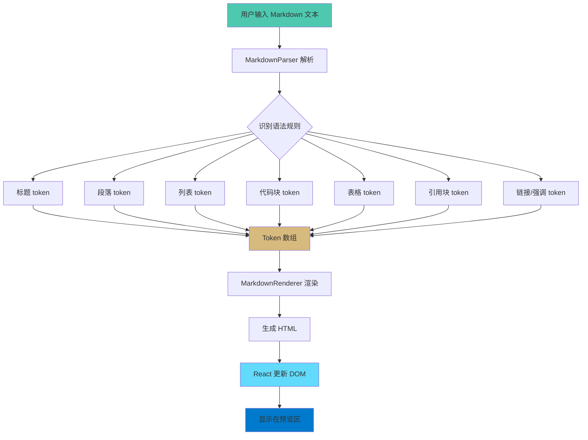
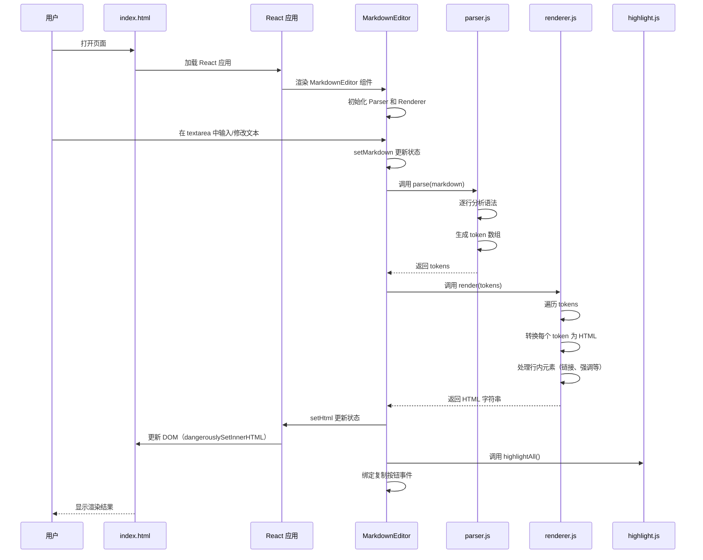
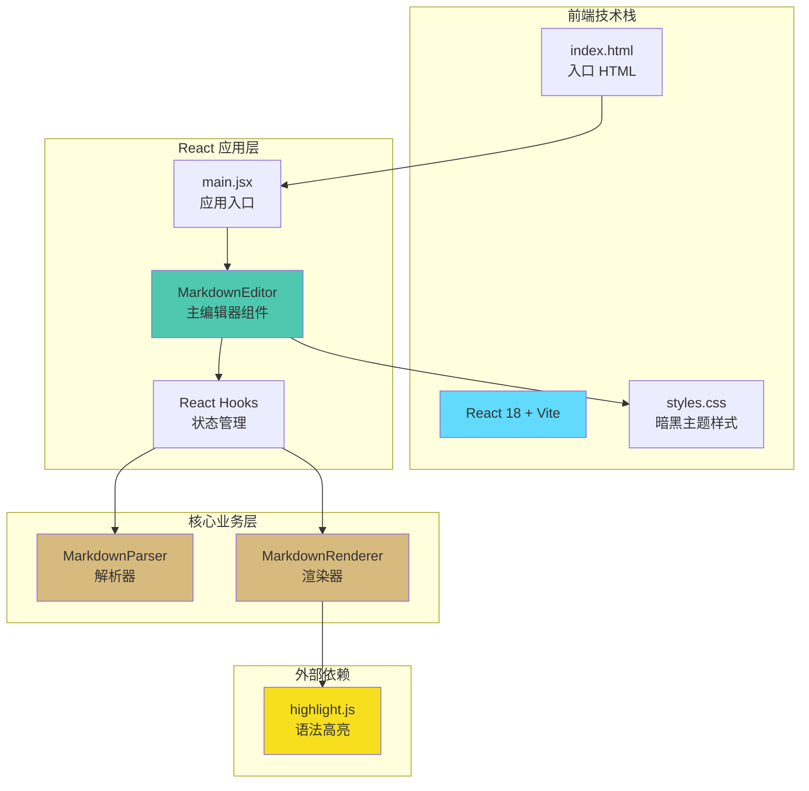

# 实现原理

Markdown 渲染器采用两步流程：**解析 → 渲染**。解析器将 Markdown 文本转换为结构化的 token 数组，渲染器将 token 数组转换为最终的 HTML。本项目基于 **React + Vite** 构建，使用函数式组件和 Hooks 实现响应式渲染。

## 工作流程图



## 执行步骤序列图



## 架构概览图



## 核心模块说明

### 1. MarkdownParser（解析器）

负责将 Markdown 文本解析为结构化的 token 数组。

**主要方法：**

- `parse(text)`: 主解析方法，将整个文本解析为 token 数组
- `parseHeading(line)`: 解析标题（以 # 开头）
- `parseCodeBlock(lines, startIndex)`: 解析代码块（被 ``` 包围）
- `parseBlockquote(lines, startIndex)`: 解析引用块（以 > 开头），支持多行
- `parseTable(lines, startIndex)`: 解析 GFM 表格（以 | 开头）
- `parseList(lines, startIndex, listType, baseIndent)`: 解析列表（有序/无序），支持递归解析嵌套列表
- `parseInline(text)`: 解析行内元素（链接、强调、代码等）

**解析策略：**
- 逐行扫描，根据行首特征判断语法类型
- 代码块、引用块、表格和列表需要多行处理，使用循环收集完整内容
- 列表通过缩进层级递归解析嵌套结构
- 行内元素使用正则表达式匹配
- 表格跳过分隔行（|---|）进行解析

### 2. MarkdownRenderer（渲染器）

负责将 token 数组转换为 HTML 字符串。

**主要方法：**

- `render(tokens)`: 主渲染方法，遍历 tokens 并生成 HTML
- `renderToken(token)`: 根据 token 类型分发到具体的渲染方法
- `renderHeading(token)`: 渲染标题，支持行内元素
- `renderParagraph(token)`: 渲染段落，处理行内格式
- `renderCodeBlock(token)`: 渲染代码块，进行 HTML 转义
- `renderList(token)`: 渲染列表，递归渲染嵌套列表（通过 item.children）
- `renderBlockquote(token)`: 渲染引用块，支持多行
- `renderTable(token)`: 渲染 GFM 表格
- `escapeHtml(text)`: HTML 转义，防止 XSS 攻击
- `encodeForDataAttr(text)`: 编码字符串以安全存储在 data 属性中

**渲染策略：**
- 每个 token 类型都有对应的渲染方法
- 行内元素（链接、强调等）在渲染段落和标题时处理
- 代码块内容需要 HTML 转义，避免被解析为 HTML

### 3. MarkdownEditor（React 组件）

连接用户输入和渲染输出的桥梁，使用 React Hooks 实现响应式渲染。

**主要 Hooks：**

- `useState`: 管理 Markdown 文本和 HTML 内容的状态
- `useRef`: 存储解析器和渲染器实例（避免重复创建）
- `useEffect`: 监听 Markdown 变化并触发渲染
- `useEffect`: 渲染完成后执行代码高亮和事件绑定

**功能：**

- 响应式更新：用户输入时自动触发重新渲染
- 代码高亮：集成 highlight.js，渲染后自动高亮代码块
- 复制功能：为每个代码块绑定一键复制按钮
- 性能优化：使用 `useRef` 缓存 Parser 和 Renderer 实例

**组件结构：**

```javascript
MarkdownEditor
├── useState: markdown (用户输入的文本)
├── useState: html (渲染后的 HTML)
├── useRef: parser (解析器实例)
├── useRef: renderer (渲染器实例)
├── useRef: outputRef (预览区域 DOM 引用)
└── useEffect: 监听状态变化并执行渲染
    ├── 调用 parser.parse(markdown)
    ├── 调用 renderer.render(tokens)
    ├── 调用 hljs.highlightAll()
    └── 绑定复制按钮事件
```

## 解析流程详解

### Token 类型

解析器支持以下 token 类型：

| Token 类型 | 示例 | 说明 |
|-----------|------|------|
| `heading` | `{ type: 'heading', level: 1, content: '标题' }` | 标题，level 为 1-6 |
| `paragraph` | `{ type: 'paragraph', content: '段落文本' }` | 普通段落 |
| `code-block` | `{ type: 'code-block', language: 'js', content: '代码' }` | 代码块 |
| `list` | `{ type: 'list', listType: 'unordered', items: [{content, children?}] }` | 列表，支持嵌套（items 中的 item 可包含 children 数组） |
| `blockquote` | `{ type: 'blockquote', content: '引用内容' }` | 引用块 |
| `table` | `{ type: 'table', headers: ['列1', '列2'], rows: [['数据1', '数据2']], columnCount: 2 }` | GFM 表格 |
| `hr` | `{ type: 'hr' }` | 水平分割线 |
| `empty` | `{ type: 'empty' }` | 空行 |

### 解析优先级

解析器按照以下优先级识别语法：

1. **代码块**（```） - 最高优先级，避免内容被其他规则匹配
2. **引用**（>） - 块级元素
3. **标题**（#） - 块级元素
4. **表格**（|） - GFM 扩展，块级元素
5. **列表**（-、*、+、数字） - 块级元素，支持多行
6. **水平分割线**（---） - 块级元素
7. **段落** - 默认处理，包含行内元素解析

### 行内元素处理

行内元素在渲染阶段处理，解析顺序：

1. **代码**（`） - 优先处理，避免与其他语法冲突
2. **图片**（） - 包含可选的 title 属性
3. **删除线**（~~） - 双波浪号
4. **粗体+斜体**（***） - 组合格式
5. **粗体**（**）
6. **斜体**（*）
7. **链接**（[text](url)） - 包含可选的 title 属性

## 渲染流程详解

### HTML 生成策略

1. **块级元素**：每个 token 对应一个 HTML 块级元素
2. **行内元素**：在渲染块级元素时，递归调用 `parseInline()` 处理内容
3. **HTML 转义**：代码块内容必须转义，防止注入攻击
4. **表格**：使用标准 HTML `<table>` 结构，支持表头和数据行

### 样式支持

渲染器输出带有语义化的 HTML 标签和 CSS 类名：

- 代码块：`<figure class="code-block" data-code="..."><div class="code-header"><span class="code-lang">{language}</span><button class="code-copy-btn">...</button></div><pre><code class="language-{language}">...` - 接近 VS Code 预览的结构，配合 highlight.js 实现语法高亮，并内置复制按钮
- 链接：`<a href="...">` - 标准 HTML 链接
- 其他：标准 HTML5 语义化标签

### UI 风格（接近 Markdown All in One）

1. **代码块头部**：在代码块上方增加 `.code-header`，右侧显示语言（来自围栏语言标记）。
2. **代码语法高亮**：集成 highlight.js（v11.9.0），使用 `github-dark-dimmed` 主题，适配暗黑界面。`MarkdownEditor` 组件在渲染后（通过 `useEffect` 监听 html 变化）调用 `hljs.highlightAll()`。
3. **代码复制按钮**：在 `.code-header` 右侧加入 `.code-copy-btn`，点击复制 `figure.code-block` 的 `data-code` 内容，成功后按钮显示“已复制”。
4. **引用块**：采用浅蓝边框与淡色背景，提升可读性。
5. **版心宽度**：默认预览全宽显示；如需居中版心，可在 `#markdown-output` 添加 `max-width` 与 `margin: 0 auto`（当前默认未启用）。

### 代码块复制实现

1. **数据来源**：渲染时使用原始代码文本存入 `figure.code-block` 的 `data-code` 属性。
2. **安全编码**：通过 `encodeURIComponent` 编码（`renderer.encodeForDataAttr`），事件侧用 `decodeURIComponent` 还原。
3. **事件绑定**：`MarkdownEditor` 组件在每次渲染后（通过 `useEffect` 监听 html 变化）执行 `bindCopyButtons()`，为 `.code-copy-btn` 绑定点击处理；优先使用 `navigator.clipboard.writeText`，失败时降级为 `execCommand('copy')`。
4. **交互反馈**：复制成功为按钮添加 `copied` 类名，2 秒后移除；样式在 `styles.css` 中控制。
5. **React 集成**：使用 `dangerouslySetInnerHTML` 渲染 HTML 后，通过 DOM 查询和事件绑定实现复制功能。

### 嵌套列表实现

解析器支持多层嵌套列表，通过缩进层级识别嵌套关系：

1. **缩进识别**：通过前导空格数量判断列表层级，每2个或更多空格为一个缩进层级
2. **递归解析**：`parseList()` 方法接受 `baseIndent` 参数，递归解析嵌套列表
3. **数据结构**：每个列表项（item）可以包含 `children` 数组，存储完整的嵌套列表 token
4. **混合类型**：支持同一文档中混合使用有序和无序列表，每个嵌套列表保持独立类型
5. **渲染策略**：`renderList()` 递归渲染 `item.children`，确保每个嵌套列表使用正确的标签（`<ul>` 或 `<ol>`）

**示例结构**：
```javascript
{
  type: 'list',
  listType: 'unordered',
  items: [
    { content: '一级列表项', children: [
      {
        type: 'list',
        listType: 'ordered',
        items: [{ content: '二级有序列表项' }]
      }
    ]}
  ]
}
```

### 空白与间距策略

为获得舒适、统一的版式，本项目对空白和间距做了如下约定：

1. **空行渲染为 `<br>`**：空行 token（`empty`）在渲染阶段输出 `<br>` 标签，提供适当的段落分隔。

2. **段落与块级元素的外边距**：
   - 段落：上下 `0.8em` - 提供舒适的段落间距
   - 列表与列表项：列表上下 `0.8em`、列表项上下 `0.25em`
   - 代码块：上下 `0.8em` - 与其他块级元素保持一致
   - 引用：上下 `0.8em` - 与其他块级元素保持一致
   - 分割线：上下 `1em` - 提供更明显的视觉分隔

3. **标题间距重新校准**（确保层次分明）：
   - H1：`0.8em 0 0.4em 0`（上边距 0.8em，下边距 0.4em）
   - H2：`0.7em 0 0.3em 0`（上边距 0.7em，下边距 0.3em）
   - H3：`0.6em 0 0.3em 0`（上边距 0.6em，下边距 0.3em）
   - H4：`0.5em 0 0.2em 0`（上边距 0.5em，下边距 0.2em）
   - H5：`0.4em 0 0.2em 0`（上边距 0.4em，下边距 0.2em）
   - H6：`0.3em 0 0.2em 0`（上边距 0.3em，下边距 0.2em）

这些数值在 `styles.css` 中定义，旨在提升可读性，提供舒适的视觉间距，同时保持文档结构的清晰层次。

## 设计模式应用

1. **职责分离**：Parser 负责解析，Renderer 负责渲染，React 组件负责视图和状态管理
2. **策略模式**：`renderToken()` 根据 token 类型选择不同的渲染策略
3. **函数式编程**：各模块都是纯函数，无副作用，易于测试
4. **单一职责**：每个方法只做一件事，函数尽量小且可复用
5. **Hooks 模式**：使用 React Hooks 分离副作用和业务逻辑
6. **受控组件**：textarea 使用受控模式，通过状态更新驱动渲染

## 扩展性

### 添加新的语法支持

1. **在 Parser 中添加识别逻辑**：
   ```javascript
   // 在 parse() 方法中添加新的条件判断
   if (isNewSyntax(line)) {
       return this.parseNewSyntax(lines, i);
   }
   ```

2. **定义新的 Token 类型**：
   ```javascript
   {
       type: 'new-syntax',
       // ... 相关属性
   }
   ```

3. **在 Renderer 中添加渲染逻辑**：
   ```javascript
   case 'new-syntax':
       return this.renderNewSyntax(token);
   ```

### 性能优化建议

- 使用防抖（debounce）减少频繁渲染和高亮处理
- 大文档可以考虑增量解析
- React 优化：
  - 使用 `useRef` 缓存 Parser 和 Renderer 实例，避免重复创建
  - 考虑使用 `useMemo` 缓存解析结果（如果依赖项不变）
  - 可以考虑虚拟滚动（Virtual Scrolling）处理超大文档
- 代码语法高亮已集成 highlight.js，如需自定义可以：
  - 更换主题：修改 `index.html` 中的 CSS 链接
  - 限制语言支持：引入特定语言的子集以减少体积
  - 使用 CDN 或本地文件：当前使用 CDN，离线环境需要下载到本地

