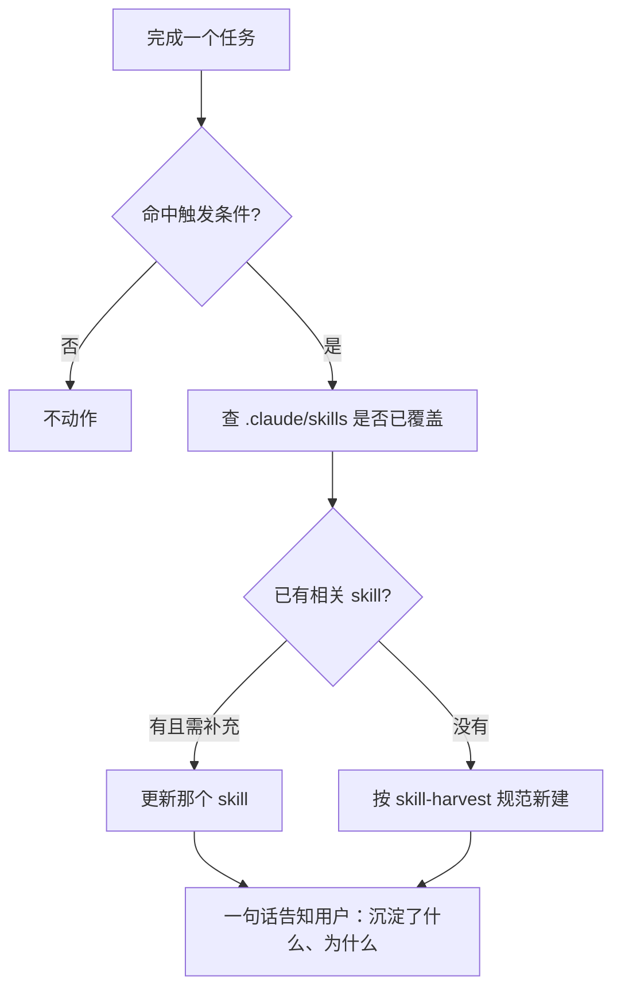

# CLAUDE.md

编码规范见 [AGENTS.md](./AGENTS.md)，以下是快速摘要和补充说明。

## 项目概述

Markdown 内容创作工具，支持 Markdown 编辑/预览、微信公众号格式化、Notion 导出、小说写作辅助等功能。

- **技术栈**：React 18 + Vite 5 + Zustand 5 + BlockNote 0.47 + Ant Design 5 + shiki 3
- **语言**：纯 JavaScript（JSX），无 TypeScript
- **包管理**：pnpm

## 快速上手

```bash
pnpm dev          # 开发服务器
pnpm build        # 构建
pnpm test:unit    # 单元测试（vitest）
pnpm test:e2e     # E2E 测试（playwright）
```

## 关键约定（必须遵守）

1. **不引入 TypeScript**，所有文件保持 `.js` / `.jsx`
2. **全局状态**统一走 `apps/editor/renderer/src/store/useEditorStore.js`（zustand），不要新建其他全局 store
3. **样式**用 CSS class + CSS 变量，颜色值从 `design-tokens.css` 取，不硬编码
4. **核心逻辑**（解析/渲染）保持无副作用纯函数，改 `packages/markdown-core/src/parser.js` / `packages/markdown-core/src/renderer.js` 前先看懂现有结构

## 常见入口

| 需求 | 看这里 |
|------|--------|
| 编辑器主逻辑 | `apps/editor/renderer/src/components/MarkdownEditor.jsx` |
| 全局状态 | `apps/editor/renderer/src/store/useEditorStore.js` |
| Electron 主进程 | `apps/editor/main/main.js` + `apps/editor/main/preload.js` |
| Markdown 解析/渲染 | `packages/markdown-core/src/parser.js` + `packages/markdown-core/src/renderer.js` |
| 微信格式化 | `apps/editor/renderer/src/utils/wechatCopy.js` + `apps/editor/renderer/src/utils/wechatTemplates.js` |
| Notion 集成 | `apps/editor/renderer/src/utils/notionService.js` + `apps/editor/renderer/src/utils/notionConverter.js` |
| 小说辅助 | `apps/editor/renderer/src/core/novel/` |
| CSS 变量 | `apps/editor/renderer/src/styles/design-tokens.css` |

## Skill 自主进化（自动沉淀，无需用户提醒）

本项目希望在开发过程中持续沉淀有价值的 skill。**每完成一个有实质内容的任务后，主动做一次沉淀判断，不要等用户开口。**

### 触发条件（满足任一即评估）

完成任务后，若过程中出现下面任一情况，就走 `skill-harvest` skill 做沉淀判断：

- 这类任务**会反复出现**（如又加了一种 Markdown 语法、又加了一个微信模板）
- 踩到了**不看代码想不到的坑**，并找到了正确做法
- 走了一套**固定多步、容易漏步**的流程
- 用到了**项目特有约定**且现有 skill 没覆盖

### 自动动作



1. 命中触发条件 → 调用 `skill-harvest` skill。
2. **先查重**：扫 `.claude/skills/`，已有相关 skill 就**更新**它，不新建重复的。
3. 没有就**新建** `.claude/skills/<name>/SKILL.md`，frontmatter 和正文按 `skill-harvest` 规范写。
4. 沉淀后用**一句话**告知用户：沉淀/更新了哪个 skill、为什么值得沉淀。不打断当前工作流，不长篇大论。

### 边界（避免噪音）

- 一次性任务、纯通用常识、AGENTS.md 已写清的静态规范——**不沉淀**。
- 拿不准是否值得沉淀时，**先问用户一句**再决定，宁可少沉淀也不要制造一堆低价值 skill。
- 沉淀本身遵循"最小化"：能更新就不新建，能复用片段就不重写。

### 现有 skill 清单（`.claude/skills/`）

| skill | 作用 |
|-------|------|
| `safe-change-workflow` | 改代码标准流程：定向搜索→最小改动→10 case→跑单测 |
| `mermaid-verify` | Mermaid 图自检：语法可渲染、暗黑主题清晰 |
| `md-render-parser-renderer` | 改 parser/renderer 核心解析渲染逻辑的规范 |
| `md-render-store` | 改全局状态（zustand）的规范 |
| `md-render-wechat` | 微信公众号格式化的规范 |
| `skill-harvest` | 判断并生成新 skill（本进化机制的执行器） |
| `pre-commit-secrets` | 提交/push 前扫描 API key、.env、私钥等敏感信息 |
