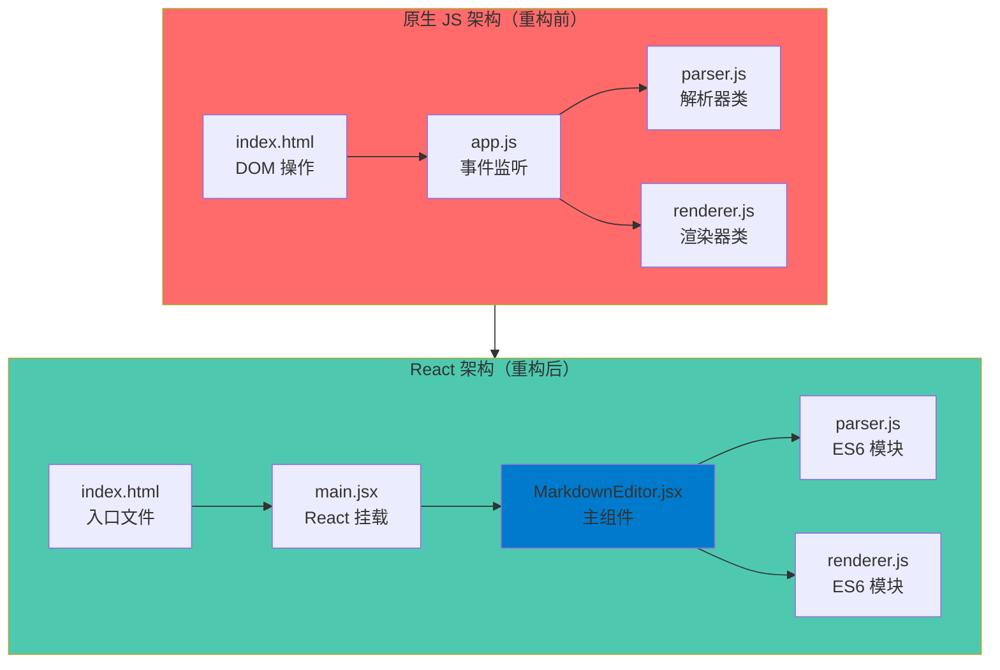
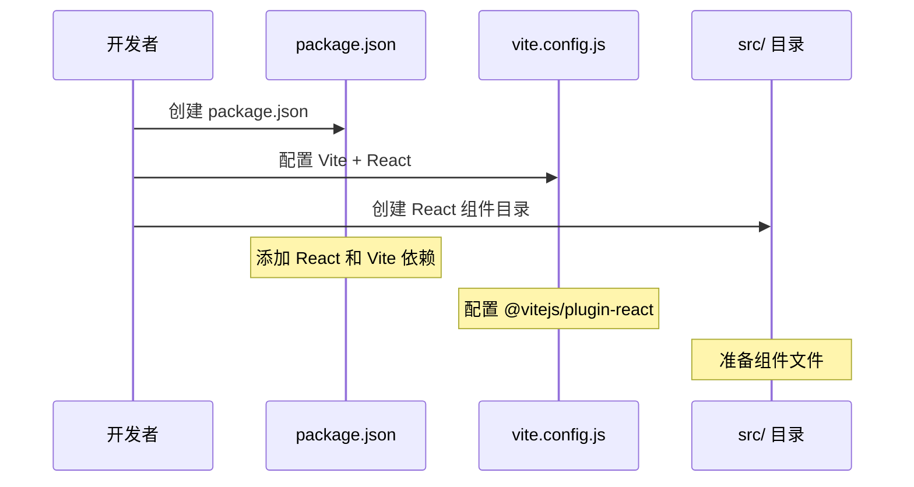
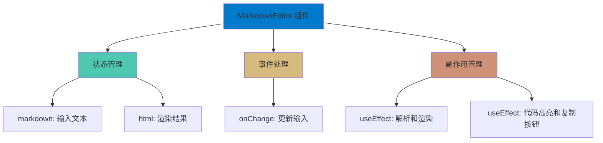
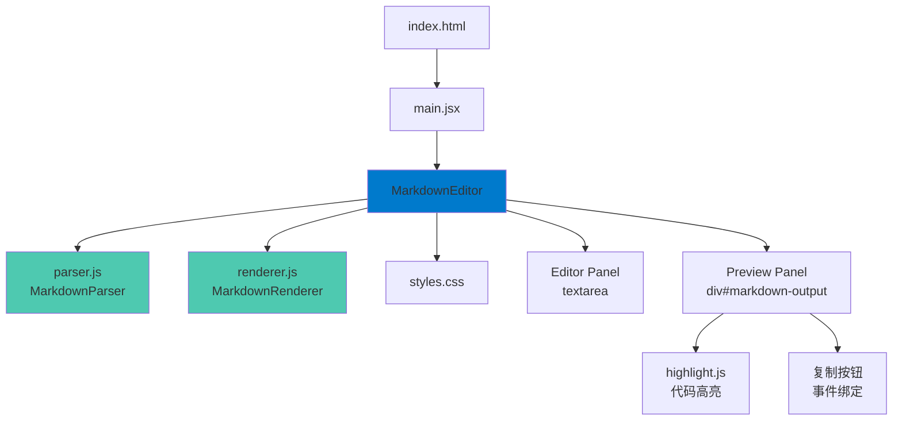
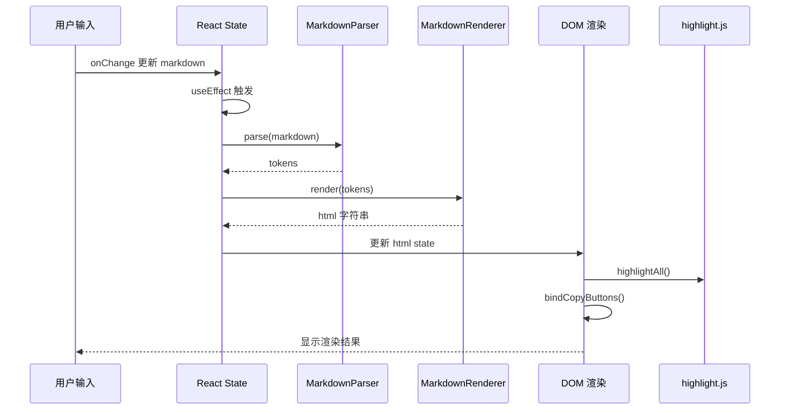

# React 迁移分析报告

## 一、重构原理

### 1.1 重构目标

将原生 JavaScript 实现的 Markdown 渲染器迁移到 React 框架，保持功能完全一致，提升代码的可维护性和扩展性。

### 1.2 架构变化



### 1.3 核心变化对比

| 维度 | 原生 JS | React |
|------|---------|-------|
| 状态管理 | DOM 直接操作 | React State |
| 事件处理 | addEventListener | onChange 等 React 事件 |
| 渲染更新 | innerHTML 手动更新 | 声明式渲染（JSX） |
| 代码组织 | 全局作用域 | 组件化模块 |
| 生命周期 | 无 | useEffect hooks |
| 构建工具 | 无（直接运行） | Vite |

## 二、执行步骤

### 2.1 项目初始化



**步骤详解：**

1. **创建 `package.json`**
   - 配置项目元信息
   - 添加 React 依赖（react, react-dom）
   - 添加开发依赖（vite, @vitejs/plugin-react）
   - 配置构建脚本（dev, build, preview）

2. **创建 `vite.config.js`**
   - 引入 React 插件
   - 配置开发服务器（端口 3000）

3. **创建 `src/` 目录**
   - 用于存放 React 组件和入口文件

### 2.2 模块化改造

**步骤详解：**

1. **`parser.js` 改造**
   - 将 `class MarkdownParser` 改为 `export class MarkdownParser`
   - 保持类实现完全不变

2. **`renderer.js` 改造**
   - 添加 `import { MarkdownParser } from './parser.js'`
   - 将 `class MarkdownRenderer` 改为 `export class MarkdownRenderer`
   - 优化构造函数：在构造函数中创建 `parser` 实例，避免每次渲染都新建实例
   - 修改 `renderHeading`、`renderParagraph`、`renderBlockquote` 方法，使用 `this.parser` 而非局部创建

### 2.3 React 组件开发



**步骤详解：**

1. **创建 `src/MarkdownEditor.jsx`**
   - 使用 `useState` 管理 markdown 输入和 html 输出
   - 使用 `useRef` 保存 parser 和 renderer 实例（避免重复创建）
   - 使用 `useRef` 引用预览 DOM 节点（用于 highlight.js 和复制按钮）
   - 实现 `updatePreview` 函数（解析 + 渲染）
   - 实现 `copyCode` 函数（复制逻辑，保持原有实现）
   - 实现 `bindCopyButtons` 函数（绑定复制按钮事件）
   - 使用 `useEffect` 监听 markdown 变化，触发预览更新
   - 使用 `useEffect` 在 html 更新后执行代码高亮和按钮绑定
   - JSX 结构：保持原有的 HTML 结构（container、editor-panel、preview-panel）

2. **创建 `src/main.jsx`**
   - 导入 React 和 ReactDOM
   - 导入 MarkdownEditor 组件
   - 使用 `ReactDOM.createRoot` 挂载应用
   - 包裹 `React.StrictMode`（开发模式检查）

### 2.4 入口文件更新

**步骤详解：**

1. **更新 `index.html`**
   - 移除原有的 DOM 结构（container、textarea、preview）
   - 添加 `<div id="root"></div>` 作为 React 挂载点
   - 保留 highlight.js 的 CSS 和 JS（样式和语法高亮）
   - 添加 `<script type="module" src="/src/main.jsx"></script>` 作为入口

## 三、代码改动说明

### 3.1 文件结构变化

```
md-render/
├── index.html          # 简化，仅作为入口
├── parser.js           # 改为 ES6 export
├── renderer.js         # 改为 ES6 export + import
├── styles.css          # 保持不变（组件中导入）
├── package.json        # 新增（项目配置）
├── vite.config.js      # 新增（构建配置）
├── src/                # 新增（React 组件目录）
│   ├── main.jsx        # 新增（React 入口）
│   └── MarkdownEditor.jsx  # 新增（主组件）
├── app.js              # 已废弃（功能迁移到组件）
└── README.md           # 保持不变
```

### 3.2 核心代码对比

#### 3.2.1 状态管理

**原生 JS（app.js）：**
```javascript
const inputElement = document.getElementById('markdown-input');
const outputElement = document.getElementById('markdown-output');
// 从 DOM 直接读取/写入
```

**React（MarkdownEditor.jsx）：**
```javascript
const [markdown, setMarkdown] = useState(DEFAULT_MARKDOWN);
const [html, setHtml] = useState('');
// 使用 React State 管理
```

#### 3.2.2 事件处理

**原生 JS（app.js）：**
```javascript
inputElement.addEventListener('input', updatePreview);
```

**React（MarkdownEditor.jsx）：**
```javascript
<textarea
  value={markdown}
  onChange={(e) => setMarkdown(e.target.value)}
/>
```

#### 3.2.3 渲染更新

**原生 JS（app.js）：**
```javascript
outputElement.innerHTML = html;
// 手动更新 DOM
```

**React（MarkdownEditor.jsx）：**
```javascript
<div
  ref={outputRef}
  dangerouslySetInnerHTML={{ __html: html }}
/>
// 声明式渲染，React 自动更新
```

#### 3.2.4 生命周期

**原生 JS（app.js）：**
```javascript
// 初始化渲染
updatePreview();
```

**React（MarkdownEditor.jsx）：**
```javascript
// 监听 markdown 变化
useEffect(() => {
  updatePreview();
}, [markdown]);

// 渲染后执行高亮和按钮绑定
useEffect(() => {
  if (window.hljs) {
    window.hljs.highlightAll();
  }
  bindCopyButtons();
}, [html]);
```

### 3.3 保持的功能

1. ✅ **所有 Markdown 语法支持**（标题、段落、列表、代码块、链接、强调、引用、分割线）
2. ✅ **嵌套列表支持**
3. ✅ **代码语法高亮**（highlight.js）
4. ✅ **代码块复制功能**（复制按钮和反馈）
5. ✅ **实时预览**
6. ✅ **暗黑主题样式**
7. ✅ **所有 UI 元素和交互**

### 3.4 代码优化

1. **性能优化**
   - 使用 `useRef` 保存 parser 和 renderer 实例，避免每次渲染都创建新实例
   - 使用 `useRef` 引用 DOM 节点，避免重复查询

2. **代码复用**
   - 将复制逻辑封装为函数（`copyCode`）
   - 将按钮绑定逻辑封装为函数（`bindCopyButtons`）

3. **模块化**
   - parser 和 renderer 作为独立的 ES6 模块
   - React 组件独立封装，职责清晰

## 四、架构设计

### 4.1 组件层次结构



### 4.2 数据流



### 4.3 设计模式应用

1. **组件化模式**
   - MarkdownEditor 作为单一职责组件，负责整个编辑器功能

2. **状态管理模式**
   - 使用 React Hooks（useState, useEffect, useRef）管理状态和副作用

3. **依赖注入模式**
   - parser 和 renderer 通过 import 注入，便于测试和替换

4. **策略模式**
   - parser 和 renderer 的解析和渲染策略保持不变，通过 ES6 模块导出

5. **函数式编程**
   - 组件使用函数式组件，纯函数处理逻辑
   - parser 和 renderer 保持纯函数特性（无副作用）

## 五、测试用例与预期结果

### 5.1 基础功能测试

| 测试用例 | 输入 | 预期结果 |
|---------|------|---------|
| 标题渲染 | `# 一级标题` | 显示为 `<h1>一级标题</h1>` 样式 |
| 段落渲染 | `这是段落` | 显示为普通段落文本 |
| 粗体文本 | `**粗体**` | 显示为加粗文本 |
| 斜体文本 | `*斜体*` | 显示为斜体文本 |
| 行内代码 | `` `code` `` | 显示为黄色背景的行内代码 |
| 代码块 | ` ```js\nconsole.log('test');\n``` ` | 显示语法高亮的代码块，带复制按钮 |
| 链接 | `[GitHub](https://github.com)` | 显示为可点击链接 |
| 引用 | `> 引用内容` | 显示为带左边框的引用块 |
| 无序列表 | `- 项目1\n- 项目2` | 显示为无序列表 |
| 有序列表 | `1. 项目1\n2. 项目2` | 显示为有序列表 |
| 嵌套列表 | `- 一级\n  - 二级` | 显示为嵌套列表结构 |
| 分割线 | `---` | 显示为水平分割线 |

### 5.2 交互功能测试

| 测试用例 | 操作 | 预期结果 |
|---------|------|---------|
| 实时预览 | 在输入框输入文本 | 预览区域实时更新 |
| 代码复制 | 点击代码块复制按钮 | 代码复制到剪贴板，按钮显示"已复制" |
| 代码高亮 | 输入带语言标记的代码块 | 代码块显示语法高亮 |
| 默认内容 | 页面加载 | 显示默认示例 Markdown 内容 |

### 5.3 边界情况测试

| 测试用例 | 输入 | 预期结果 |
|---------|------|---------|
| 空输入 | `` | 预览区域为空 |
| 只有空行 | `\n\n\n` | 显示多个 `<br>` |
| 未闭合代码块 | ` ```js\n代码` | 正常显示代码块内容 |
| 混合嵌套列表 | `- 无序\n  1. 有序\n    - 无序` | 正确显示混合嵌套结构 |
| 特殊字符 | `<script>alert('xss')</script>` | 正确转义，不执行脚本 |

### 5.4 性能测试

| 测试用例 | 输入规模 | 预期结果 |
|---------|---------|---------|
| 小文档 | 100 行 | 渲染流畅，无明显延迟 |
| 中文档 | 1000 行 | 渲染流畅，可能有轻微延迟 |
| 大文档 | 10000 行 | 可能有一定延迟，但不应卡死 |

## 六、使用指南

### 6.1 安装依赖

```bash
npm install
```

### 6.2 开发模式

```bash
npm run dev
```

访问 `http://localhost:3000`

### 6.3 构建生产版本

```bash
npm run build
```

输出到 `dist/` 目录

### 6.4 预览生产版本

```bash
npm run preview
```

## 七、迁移总结

### 7.1 优势

1. **代码组织更清晰**
   - 组件化架构，职责分明
   - ES6 模块化，依赖关系明确

2. **状态管理更规范**
   - React State 管理，避免直接操作 DOM
   - 声明式渲染，代码更易理解

3. **扩展性更好**
   - 易于添加新功能（新的组件、Hook）
   - 易于集成其他 React 生态库

4. **开发体验更好**
   - Vite 热更新，开发效率高
   - TypeScript 支持（可选）

5. **性能优化空间**
   - 可添加 useMemo、useCallback 优化
   - 可添加虚拟滚动处理大文档

### 7.2 注意事项

1. **保持向后兼容**
   - parser.js 和 renderer.js 的核心逻辑未变
   - 样式文件 styles.css 保持不变

2. **构建依赖**
   - 需要 Node.js 环境
   - 需要 npm/yarn 安装依赖

3. **浏览器兼容性**
   - 支持现代浏览器（ES6+）
   - highlight.js 仍通过 CDN 引入

### 7.3 后续优化建议

1. **性能优化**
   - 使用 `useMemo` 缓存解析结果
   - 使用防抖（debounce）减少频繁渲染
   - 大文档可使用虚拟滚动

2. **功能扩展**
   - 添加工具栏（格式化、导出等）
   - 添加主题切换
   - 添加文件导入/导出

3. **代码质量**
   - 添加 TypeScript 类型定义
   - 添加单元测试（Jest + React Testing Library）
   - 添加 E2E 测试（Playwright）

4. **用户体验**
   - 添加快捷键支持
   - 添加撤销/重做功能
   - 添加语法错误提示

## 八、技术栈

- **React 18.2.0** - UI 框架
- **Vite 5.0.8** - 构建工具
- **highlight.js 11.9.0** - 代码语法高亮（CDN）
- **ES6 模块** - 模块化方案

## 九、文件变更清单

### 新增文件
- `package.json` - 项目配置
- `vite.config.js` - Vite 构建配置
- `src/main.jsx` - React 入口文件
- `src/MarkdownEditor.jsx` - 主组件
- `REACT_MIGRATION.md` - 本文档

### 修改文件
- `index.html` - 简化为 React 入口
- `parser.js` - 添加 ES6 export
- `renderer.js` - 添加 ES6 import/export，优化 parser 实例管理

### 废弃文件
- `app.js` - 功能已迁移到 React 组件（可删除）

### 保持不变
- `styles.css` - 样式文件
- `README.md` - 项目说明
- `ARCHITECTURE.md` - 架构文档

---

**报告生成时间：** 2024年

**迁移完成度：** ✅ 100%

**功能完整性：** ✅ 所有原有功能保持不变

