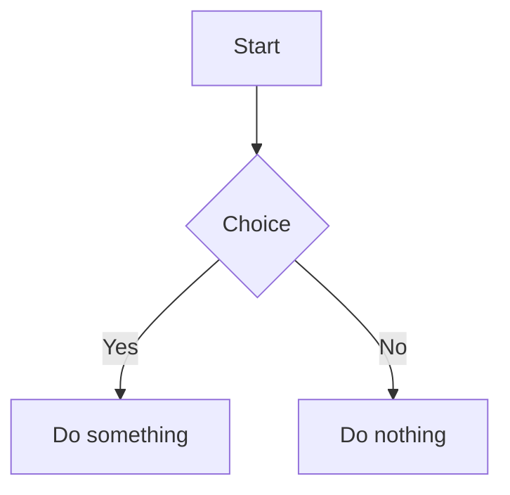

# MD Render

[中文版说明](./README.zh.md)

**A local-first, AI-driven Chinese content creation workbench.**

Built with **React + Vite + Electron**. The product has evolved from a Markdown renderer into an integrated workbench for **daily planning → writing → knowledge → multi-channel publishing**, while keeping its self-built CommonMark / GFM pipeline (`packages/markdown-core`), a desktop app for macOS (`apps/editor`), and a web build for browser or GitHub Pages.

| | |
|---|---|
| **For** | WeChat / blog authors · solo content creators · knowledge workers who write, organize, and publish |
| **Keywords** | Local-first · AI-driven · daily-driven · writing-first · publish-friendly |
| **Version** | `1.0.12` — [release process](./docs/release-process.md) |
| **Roadmap** | [docs/content-creation-roadmap.md](./docs/content-creation-roadmap.md) |

The product goal is to connect **plan → collect → write → revise → finalize → publish** into one workflow: Daily handles today's work, the editor handles long-form writing, the AI assistant rewrites and operates the app, the knowledge base holds your library, and WeChat / Notion handle outbound publishing.

---

## Available today

### Daily notebook

- Per-day **tasks**, **notes**, **events**, and a cross-day **todo pool**
- Task priority (high / medium / low) and category tags (work, creation, learning, life, personal)
- Date navigation, cross-day carryOver, inline quick-add
- Desktop disk sync (Electron)

### AI assistant

- Cowork-style agent panel: read/write documents, switch surfaces, and manage Daily items from chat
- Paragraph-level writing actions: compress, expand, polish, outline, continue, title suggestions, tone, key points, and more
- Platform variants: WeChat Official Account, Xiaohongshu, Zhihu, etc.
- Document workspace leans creation assistant; overview, Daily, board, and other non-document surfaces lean workbench assistant

### Write & preview

- CommonMark / GFM: headings, lists, blockquotes, tables, strikethrough, images, links
- Real-time preview, edit / preview toggle, table of contents
- Code blocks with **Shiki** highlighting and one-click copy
- Mermaid diagrams with fullscreen view
- Light / dark / system theme
- Paper-like editing: UI stays back, content stays forward (see [docs/editor-philosophy.md](./docs/editor-philosophy.md))

### Workspace & knowledge base

- Sidebar file tree, Obsidian-style tabs; surfaces include creation home, current content, canvas, graph, search, and more
- **Web:** `localStorage` persistence
- **Desktop:** SQLite + FTS5 search, version history, `.md` disk sync
- Wikilinks (`[[Document Name]]`), backlinks, graph view
- Bookmark import; preview non-Markdown files (Office, PDF, etc.)
- Metadata filters (status, platform, doc type, tags); import / export workspace

### Publish & sync

- WeChat Official Account formatting with preview modal and multiple layout templates — primary differentiator
- Notion push / pull and batch sync
- Export current document as MD / HTML / PDF / DOCX
- GitHub Pages deployment via GitHub Actions

### Creation workflow

- **Creation dashboard** — recent drafts, active topics, material inbox, publish queue; quick actions to create drafts/topics, triage materials, or jump to publishing
- **Topic / draft board** — status lanes from idea → collecting → draft → drafting → ready / published
- **Publishing queue** — schedule ready drafts, platform tags, pre-publish checklist
- **Inspiration canvas** — card-based whiteboard for topics and materials
- **Draft metadata** — six-state lifecycle (`idea` → `published`), target platforms, summary, scheduled publish date, related docs, source materials
- **Bookmark import** — bookmarks as first-class entries in the material inbox
- **File import & preview** — MD / HTML / DOCX / CSV / etc.; preview Office, PDF, Excel and convert to Markdown

---

## What's next

Per the [content creation roadmap](./docs/content-creation-roadmap.md), the foundation and core creation loop are in place. Remaining gaps:

| Gap | Planned direction |
|-----|-------------------|
| Inbox is still early | Unified triage: paste / Notion pull → inbox → attach to topic or convert to draft |
| AI action quality & consistency | More reliable surface routing and tool execution (see [ai-assistant-quality-checklist.md](./docs/ai-assistant-quality-checklist.md)) |
| Review layer is thin | Revision checklist, version diff preview, publish archive |
| Cloud sync | Read-only snapshots and conflict strategy (see [cloud-sync-technical-plan.md](./docs/cloud-sync-technical-plan.md)) |
| Ecosystem | Web Clipper, plugin system |

**Near-term priority:** material inbox triage + review layer + AI assistant regression quality — before plugins or a generic AI chat panel.

Full phased plan (P0–P2) and module mapping: [docs/content-creation-roadmap.md](./docs/content-creation-roadmap.md).

## Quick start

### Install

```bash
pnpm install
```

### Web development

```bash
pnpm dev
```

Open `http://localhost:3000`. Edit content on the left; preview updates in real time on the right.

### Desktop development (Electron)

```bash
pnpm electron:dev
```

Native modules (`better-sqlite3`) may need a rebuild after dependency changes:

```bash
pnpm --filter @md-render/editor electron:rebuild
```

### Build

```bash
# Web bundle → apps/editor/dist/
pnpm build

# macOS desktop app → apps/editor/release/
pnpm electron:build

# Preview web build locally (default http://localhost:4173)
pnpm preview
```

## Common workflows

### Copy to WeChat Official Account

1. Write or paste Markdown in the editor.
2. Choose a layout template in **Settings → 排版风格**.
3. Click **复制到微信公众号** in the preview header (or open the WeChat preview modal).
4. Paste the converted HTML into the WeChat editor.

Notes:

- Code blocks are converted to WeChat-compatible `<pre><code>` markup.
- HTTP image URLs are upgraded to HTTPS when possible.
- Custom `class` and `data-*` attributes are stripped for compatibility.
- Conversion logic lives in `apps/editor/renderer/src/utils/wechatCopy.js`; templates in `wechatTemplates.js`.

### Workspace storage modes

| Mode | Where data lives | Best for |
|------|------------------|----------|
| Temporary workspace (web) | Browser `localStorage` | Quick notes, online demo |
| Desktop app | SQLite + disk `.md` backups | Large libraries, knowledge base, Daily notebook |

Open **Settings → 工作区** to import / export workspace data.

### Notion sync

1. Open **Settings → Notion** and enter your integration token.
2. Link a document to a Notion page, then push or pull blocks.
3. Batch sync is available from the Notion panel or **渠道同步**.

See `apps/editor/renderer/src/utils/notionService.js` for API details.

## Testing

```bash
# Unit tests (Vitest)
pnpm test:unit

# E2E tests (Playwright) — start dev server first in another terminal
pnpm dev
pnpm test:e2e

# Interactive Playwright UI
pnpm test:e2e:ui
```

E2E tests assume the app is available at `http://localhost:3000`.

## Mermaid diagrams

Use a fenced code block with language `mermaid`:

````markdown

````

- Mermaid loads via CDN and re-renders after each preview update.
- Theme follows the app light / dark setting.
- Hover a diagram to reveal the fullscreen button; close with Esc or by clicking the backdrop.

## Project structure

```
md-render/
├── package.json              # Workspace scripts & version
├── pnpm-workspace.yaml
├── scripts/
│   └── release-tag.sh        # Version tagging helper
├── docs/                     # Product & architecture notes
├── apps/
│   └── editor/
│       ├── main/             # Electron main process (IPC, SQLite, fs)
│       ├── renderer/         # React UI (Vite)
│       ├── tests/            # Vitest + Playwright
│       ├── dist/             # Web build output
│       └── release/          # Desktop build output
├── packages/
│   └── markdown-core/
│       └── src/
│           ├── parser.js     # Markdown → tokens
│           ├── renderer.js   # tokens → HTML
│           └── index.js
├── README.md
├── README.zh.md
└── ARCHITECTURE.md           # Parser / renderer deep dive
```

## Supported Markdown syntax

### Block elements

- `# Heading` — H1–H6
- `` ```code block```` — fenced code blocks (language tag enables highlighting)
- `> Quote` — blockquotes (multi-line supported)
- `- item` / `1. item` — unordered and ordered lists (nested via indentation)
- `---` / `***` / `___` — horizontal rules
- GFM tables

### Inline elements

- `**bold**`, `*italic*`, `***bold italic***`, `~~strikethrough~~`
- `` `code` ``, `[link](url)`, `[link](url "title")`
- ``, ``
- `[[Document Name]]` — wikilinks (knowledge base)

## Tech stack

| Layer | Choices |
|-------|---------|
| UI | React 18, Ant Design 5, lucide-react |
| Build | Vite 5, pnpm workspace |
| Desktop | Electron 33, electron-builder |
| State | Zustand (persist) |
| Markdown core | Self-built parser / renderer (`packages/markdown-core`) |
| Highlighting | Shiki |
| Diagrams | Mermaid (CDN) |
| Rich text | BlockNote |
| AI | Agent engine + tool registry (`core/agent/`) |
| Storage | localStorage (web) · SQLite + FTS5 (desktop) |

For parser / renderer internals, see [ARCHITECTURE.md](./ARCHITECTURE.md).

## Documentation

| Topic | Doc |
|-------|-----|
| **Content creation roadmap** | [docs/content-creation-roadmap.md](./docs/content-creation-roadmap.md) |
| Daily notebook categories | [docs/daily-notebook-task-category.md](./docs/daily-notebook-task-category.md) |
| AI assistant quality checklist | [docs/ai-assistant-quality-checklist.md](./docs/ai-assistant-quality-checklist.md) |
| Knowledge base progress | [docs/knowledge-base-progress.md](./docs/knowledge-base-progress.md) |
| Knowledge base roadmap | [docs/knowledge-base-roadmap.md](./docs/knowledge-base-roadmap.md) |
| Editor design philosophy | [docs/editor-philosophy.md](./docs/editor-philosophy.md) |
| Release & tagging | [docs/release-process.md](./docs/release-process.md) |
| Parser / renderer internals | [ARCHITECTURE.md](./ARCHITECTURE.md) |
| Agent / dev rules | [AGENTS.md](./AGENTS.md) |

## Release

Version lives in root `package.json`. To cut a release:

```bash
# 1. Bump version in package.json and commit
# 2. Preview tag
pnpm release:tag -- --dry-run
# 3. Create annotated tag and push
pnpm release:tag
```

See [docs/release-process.md](./docs/release-process.md) for the full checklist.

## Deploy to GitHub Pages

The web build from `apps/editor` can deploy to GitHub Pages via GitHub Actions.

### One-time setup

1. Open **Settings → Pages** in your GitHub repository.
2. Set **Source** to **GitHub Actions**.
3. Confirm the default branch is `main` (or adjust the workflow).

### Automatic deployment

- Workflow: `.github/workflows/deploy-pages.yml`
- Pushes to `main` build and deploy automatically; you can also trigger manually from the Actions tab.
- Vite `base` is inferred as `/<repo>/` in CI; locally it stays `/`.

### Access URL

- Personal site: `https://<username>.github.io/`
- Project page: `https://<username>.github.io/<repo>/`

If assets 404 on Pages, ensure CI sets the correct Vite `base` (this repo infers it from `GITHUB_REPOSITORY`).

## Changelog (highlights)

### v1.0.x — AI-driven creation workbench

Built on the creation foundation with Daily, AI assistant, and board UI:

- **Daily notebook**: tasks / notes / todo pool, priority & categories, cross-day carryOver
- **AI assistant**: paragraph rewrites, platform variants, surface switching and workspace actions
- **Creation board & publishing queue**: status lanes, scheduling, pre-publish checklist
- **Knowledge base P1 complete**: SQLite, FTS5, wikilinks, backlinks, graph, version history
- WeChat formatting, Notion sync, bookmark import, multi-format export, inspiration canvas

Next focus per [roadmap §7–§8](./docs/content-creation-roadmap.md): material inbox triage, review layer, AI assistant regression quality.

### v2.1 — Workspace & local storage

- Directory sidebar with nested folders; auto-save to `localStorage`

### v2.0 — CommonMark / GFM

- Strikethrough, images, link titles, multi-line blockquotes, tables

### v1.3 — Code blocks

- Copy button, syntax highlighting, VS Code–style code block header

### v1.2 — Nested lists

- Multi-level and mixed ordered / unordered lists
