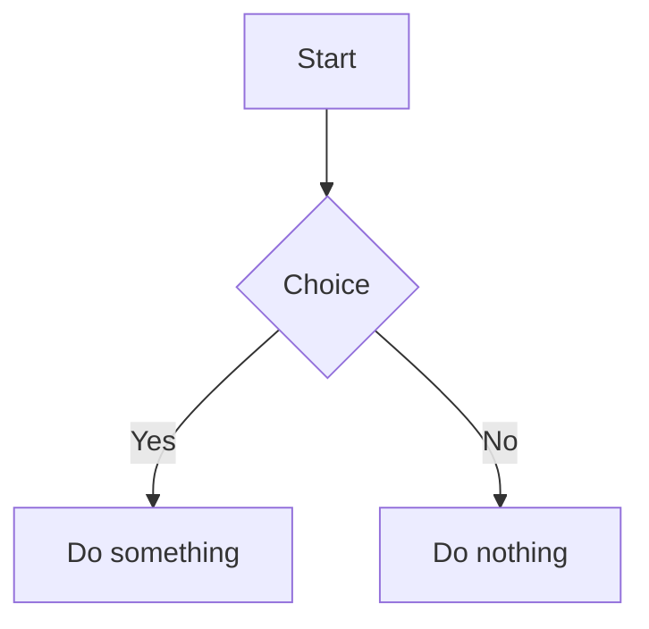

# MD Render

[中文版说明](./README.zh.md)

**A local-first, Chinese-writing-friendly content creation workbench.**

Built with **React + Vite + Electron**. It ships a self-built CommonMark / GFM Markdown pipeline (`packages/markdown-core`), a desktop app for macOS (`apps/editor`), and a web build for browser or GitHub Pages.

| | |
|---|---|
| **For** | WeChat / blog authors · knowledge creators · long-form & novel writers |
| **Keywords** | Local-first · knowledge-driven · writing-first · publish-friendly |
| **Version** | `1.0.6` — [release process](./docs/release-process.md) |
| **Roadmap** | [docs/content-creation-roadmap.md](./docs/content-creation-roadmap.md) |

The product goal is to connect **topic → collect → outline → write → revise → publish** into one workflow. The foundation and P0 creation workflow are in place; next up are AI actions, multi-platform copy, and board UI — see [What's next](#whats-next).

---

## Available today

### Write & preview

- CommonMark / GFM: headings, lists, blockquotes, tables, strikethrough, images, links
- Real-time preview, edit / preview toggle, table of contents
- Code blocks with **Shiki** highlighting and one-click copy
- Mermaid diagrams with fullscreen view
- Light / dark / system theme

### Workspace & knowledge base

- Sidebar file tree, Obsidian-style tabs, multi-surface navigation (overview, paper, knowledge base, Notion, settings)
- **Web:** `localStorage` persistence
- **Desktop:** SQLite + FTS5 search, version history, `.md` disk sync, local project mounting
- Wikilinks (`[[Document Name]]`), backlinks, graph view
- Bookmark import; preview non-Markdown files (Office, PDF, etc.)
- Import / export workspace

### Publish & sync

- WeChat Official Account formatting with preview modal and multiple layout templates — primary differentiator
- Notion push / pull and batch sync
- Export current document as MD / HTML / PDF / DOCX
- GitHub Pages deployment via GitHub Actions

### Creation workflow (P0 — shipped)

- **Creation dashboard** — homepage with recent drafts, active topics, material inbox, and publish queue; quick actions to create a draft, topic, import material, or jump to publish search
- **Draft metadata** — six-state lifecycle (`idea` → `published`), target platforms (WeChat, Xiaohongshu, Zhihu, etc.), summary, scheduled publish date, related docs, and source materials
- **Topic & material classification** — documents are grouped by metadata (`draftStatus`, `nodeType`, tags) into drafts, topics, materials, and ready-to-publish items
- **Tags & knowledge metadata** — tags, node type, summary, aliases, related docs, backlinks; version history with restore (Electron)
- **Bookmark import** — bookmarks as first-class entries, shown on the dashboard material inbox and as bookmark cards
- **File import & preview** — import MD / HTML / DOCX / CSV / etc.; preview Office, PDF, Excel and convert to Markdown
- **Novel assistant** — entity extraction, mentions, BlockNote-based editing

---

## What's next

Per the [content creation roadmap](./docs/content-creation-roadmap.md), the foundation above is in place. Remaining gaps:

| Gap | Planned direction |
|-----|-------------------|
| No dedicated project / board UI | Standalone topic board, series view, publish-batch management (dashboard aggregates today; `creation-board` / `publishing` surfaces are placeholders) |
| AI not wired into general writing | Paragraph actions (expand, compress, tone, outline, continue) — novel assistant exists, general AI layer does not |
| Publishing is mostly WeChat + export | One-draft-multi-channel copy (Xiaohongshu / Zhihu variants), title & summary variants, pre-publish checklist |
| Inbox is early | Unified triage flow: paste / Notion pull → inbox → attach to topic or convert to draft |
| Review layer is thin | Revision checklist, version diff preview, publish archive |

**Near-term priority:** AI rewrite actions + multi-platform output + board UI — before plugins, cloud sync, or a generic AI chat panel.

Full phased plan (P0–P2), module mapping, and 4-week vNext scope: [docs/content-creation-roadmap.md](./docs/content-creation-roadmap.md).

## Quick start

### Install

```bash
pnpm install
```

### Web development

```bash
pnpm dev
```

Open `http://localhost:3000`. Edit Markdown on the left; preview updates in real time on the right.

### Desktop development (Electron)

```bash
pnpm electron:dev
```

Native modules (`better-sqlite3`) may need a rebuild after dependency changes:

```bash
pnpm --filter @md-render/editor electron:rebuild
```

### Build

```bash
# Web bundle → apps/editor/dist/
pnpm build

# macOS desktop app → apps/editor/release/
pnpm electron:build

# Preview web build locally (default http://localhost:4173)
pnpm preview
```

## Common workflows

### Copy to WeChat Official Account

1. Write or paste Markdown in the editor.
2. Choose a layout template in **Settings → 排版风格**.
3. Click **复制到微信公众号** in the preview header (or open the WeChat preview modal).
4. Paste the converted HTML into the WeChat editor.

Notes:

- Code blocks are converted to WeChat-compatible `<pre><code>` markup.
- HTTP image URLs are upgraded to HTTPS when possible.
- Custom `class` and `data-*` attributes are stripped for compatibility.
- Conversion logic lives in `apps/editor/renderer/src/utils/wechatCopy.js`; templates in `wechatTemplates.js`.

### Workspace storage modes

| Mode | Where data lives | Best for |
|------|------------------|----------|
| Temporary workspace (web) | Browser `localStorage` | Quick notes, online demo |
| Desktop app | SQLite + optional `.md` artifacts on disk | Large libraries, knowledge base |
| Local project (Electron) | Your folder on disk | Existing Markdown vaults |

Open **Settings → 工作区** to mount a local folder or import / export workspace data.

### Notion sync

1. Open **Settings → Notion** and enter your integration token.
2. Link a document to a Notion page, then push or pull blocks.
3. Batch sync is available from the Notion panel.

See `apps/editor/renderer/src/utils/notionService.js` for API details.

## Testing

```bash
# Unit tests (Vitest)
pnpm test:unit

# E2E tests (Playwright) — start dev server first in another terminal
pnpm dev
pnpm test:e2e

# Interactive Playwright UI
pnpm test:e2e:ui
```

E2E tests assume the app is available at `http://localhost:3000`.

## Mermaid diagrams

Use a fenced code block with language `mermaid`:

````markdown

````

- Mermaid loads via CDN and re-renders after each preview update.
- Theme follows the app light / dark setting.
- Hover a diagram to reveal the fullscreen button; close with Esc or by clicking the backdrop.

## Project structure

```
md-render/
├── package.json              # Workspace scripts & version
├── pnpm-workspace.yaml
├── scripts/
│   └── release-tag.sh        # Version tagging helper
├── docs/                     # Product & architecture notes
├── apps/
│   └── editor/
│       ├── main/             # Electron main process (IPC, SQLite, fs)
│       ├── renderer/         # React UI (Vite)
│       ├── tests/            # Vitest + Playwright
│       ├── dist/             # Web build output
│       └── release/          # Desktop build output
├── packages/
│   └── markdown-core/
│       └── src/
│           ├── parser.js     # Markdown → tokens
│           ├── renderer.js   # tokens → HTML
│           └── index.js
├── README.md
├── README.zh.md
└── ARCHITECTURE.md           # Parser / renderer deep dive
```

## Supported Markdown syntax

### Block elements

- `# Heading` — H1–H6
- `` ```code block```` — fenced code blocks (language tag enables highlighting)
- `> Quote` — blockquotes (multi-line supported)
- `- item` / `1. item` — unordered and ordered lists (nested via indentation)
- `---` / `***` / `___` — horizontal rules
- GFM tables

### Inline elements

- `**bold**`, `*italic*`, `***bold italic***`, `~~strikethrough~~`
- `` `code` ``, `[link](url)`, `[link](url "title")`
- ``, ``
- `[[Document Name]]` — wikilinks (knowledge base)

## Tech stack

| Layer | Choices |
|-------|---------|
| UI | React 18, Ant Design 5, lucide-react |
| Build | Vite 5, pnpm workspace |
| Desktop | Electron 33, electron-builder |
| State | Zustand (persist) |
| Markdown core | Self-built parser / renderer (`packages/markdown-core`) |
| Highlighting | Shiki |
| Diagrams | Mermaid (CDN) |
| Rich text (Novel) | BlockNote |
| Storage | localStorage (web) · SQLite + FTS5 (desktop) |

For parser / renderer internals, see [ARCHITECTURE.md](./ARCHITECTURE.md).

## Documentation

| Topic | Doc |
|-------|-----|
| **Content creation roadmap** | [docs/content-creation-roadmap.md](./docs/content-creation-roadmap.md) |
| Knowledge base progress | [docs/knowledge-base-progress.md](./docs/knowledge-base-progress.md) |
| Knowledge base roadmap | [docs/knowledge-base-roadmap.md](./docs/knowledge-base-roadmap.md) |
| Novel mode design | [docs/novel-mode-design.md](./docs/novel-mode-design.md) |
| Release & tagging | [docs/release-process.md](./docs/release-process.md) |
| Parser / renderer internals | [ARCHITECTURE.md](./ARCHITECTURE.md) |
| Agent / dev rules | [AGENTS.md](./AGENTS.md) |

## Release

Version lives in root `package.json`. To cut a release:

```bash
# 1. Bump version in package.json and commit
# 2. Preview tag
pnpm release:tag -- --dry-run
# 3. Create annotated tag and push
pnpm release:tag
```

See [docs/release-process.md](./docs/release-process.md) for the full checklist.

## Deploy to GitHub Pages

The web build from `apps/editor` can deploy to GitHub Pages via GitHub Actions.

### One-time setup

1. Open **Settings → Pages** in your GitHub repository.
2. Set **Source** to **GitHub Actions**.
3. Confirm the default branch is `main` (or adjust the workflow).

### Automatic deployment

- Workflow: `.github/workflows/deploy-pages.yml`
- Pushes to `main` build and deploy automatically; you can also trigger manually from the Actions tab.
- Vite `base` is inferred as `/<repo>/` in CI; locally it stays `/`.

### Access URL

- Personal site: `https://<username>.github.io/`
- Project page: `https://<username>.github.io/<repo>/`

If assets 404 on Pages, ensure CI sets the correct Vite `base` (this repo infers it from `GITHUB_REPOSITORY`).

## Changelog (highlights)

### v1.0.x — Creation workbench foundation

Shipped the base layer in [content-creation-roadmap.md §3.1](./docs/content-creation-roadmap.md), plus early P0:

- Electron desktop: SQLite, FTS5, wikilinks, backlinks, graph, version history, local project
- WeChat formatting & preview, Notion sync, bookmark import, multi-format export, file import / preview
- Creation dashboard, draft metadata, topic / material / publish classification
- Novel assistant, Shiki highlighting, tab bar UI

Next focus per [§7–§8 of the roadmap](./docs/content-creation-roadmap.md): AI paragraph actions, multi-platform copy, dedicated board UI.

### v2.1 — Workspace & local storage

- Directory sidebar with nested folders; auto-save to `localStorage`

### v2.0 — CommonMark / GFM

- Strikethrough, images, link titles, multi-line blockquotes, tables

### v1.3 — Code blocks

- Copy button, syntax highlighting, VS Code–style code block header

### v1.2 — Nested lists

- Multi-level and mixed ordered / unordered lists
