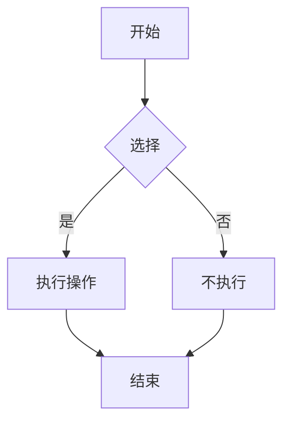

# Markdown 渲染器

一个简单、轻量级的 Markdown 渲染器，使用原生 JavaScript 实现，支持 CommonMark 规范，无需任何依赖。

## 功能特性

- ✅ 标题（H1-H6）
- ✅ 段落
- ✅ 无序列表和有序列表
- ✅ 嵌套列表
- ✅ 代码块（集成 highlight.js 语法高亮，支持一键复制）
- ✅ 行内代码
- ✅ 链接（支持 title 属性）
- ✅ 粗体和斜体文本
- ✅ 删除线
- ✅ 图片（支持 alt 和 title 属性）
- ✅ 引用块（支持多行引用）
- ✅ 水平分割线
- ✅ 表格（GFM 扩展）
- ✅ 实时预览
- ✅ 复制到微信公众号格式
- ✅ 目录面板，支持 localStorage 本地保存
- ✅ Mermaid 流程图/时序图预览（```mermaid 代码块）
- ✅ Mermaid 图表全屏预览（每个图表右上角全屏按钮）

## 使用方法

### 开发模式

1. 安装依赖：
```bash
pnpm install
```

2. 启动开发服务器：
```bash
pnpm run dev
```

3. 在浏览器中打开 `http://localhost:3000`
4. 在左侧输入框中输入 Markdown 文本
5. 右侧会实时显示渲染结果

### 复制到微信公众号

1. 在左侧输入框中输入或编辑 Markdown 文本
2. 右侧会实时显示渲染结果
3. 点击预览面板右上角的"复制到微信公众号"按钮
4. 转换后的 HTML 内容会自动复制到剪贴板
5. 在微信公众号编辑器中粘贴即可

**注意事项：**
- 代码块会自动转换为微信公众号兼容的 `<pre><code>` 格式
- 图片链接会自动转换为 HTTPS（如果原本是 HTTP）
- 所有自定义的 class 属性和 data-* 属性会被移除，以确保兼容性
- 版式预设符合公众号要求：全部文本固定字号 `16px`、段后间距 `8px`、行高 `1.6`
- 提供通用工具 `src/utils/wechatCopy.js`，可在其他模块复用转换与复制逻辑

### 目录与本地保存

1. 左侧目录面板可以管理多个 Markdown 文件和文件夹
2. 点击「新建文件」会在当前文件夹下创建空白文档
3. 点击「新建文件夹」可对笔记进行分组管理
4. 使用重命名或删除按钮管理条目（根目录不可删除）
5. 目录结构与文件内容会自动写入浏览器 `localStorage`，下次打开自动恢复

### 生产构建

```bash
pnpm run build
```

构建产物将输出到 `dist/` 目录。

### 端到端测试（Playwright）

```bash
# 在无头模式下运行全部端到端用例
pnpm run test:e2e

# 打开交互式 Playwright Test UI
pnpm run test:e2e:ui
```

默认情况下，测试会假定应用运行在 `http://localhost:3000`。  
请先在另一个终端中通过 `pnpm run dev` 启动开发服务，再执行测试命令。
## Mermaid 图表预览

- 通过 `mermaid` 语言标记的围栏代码块启用。示例：

```markdown

```

- 页面通过 CDN 加载 Mermaid，在每次预览更新后自动渲染图表。
- 主题会自动适配系统深浅色（dark/default）。
- 安全级别设为 `loose` 以便开发使用，如需更严格可按需调整。

### Mermaid 全屏

- 鼠标悬停图表会显示右上角的“全屏”按钮。
- 点击后将以遮罩层全屏展示该图表，自动适配宽度。
- 可通过关闭按钮、点击遮罩空白处或按下 Esc 退出全屏。

## 项目结构

```
md-render/
├── index.html              # 应用入口 HTML
├── package.json            # 项目配置和依赖
├── vite.config.js          # Vite 构建配置
├── src/                    # 源代码目录
│   ├── main.jsx            # React 应用入口
│   ├── components/         # React 组件
│   │   ├── MarkdownEditor.jsx   # 编辑器主壳层
│   │   └── WorkspaceSidebar.jsx # 目录侧栏组件
│   ├── core/               # 核心功能模块
│   │   ├── parser.js       # Markdown 解析器
│   │   └── renderer.js     # HTML 渲染器
│   └── styles/             # 样式文件
│       └── styles.css      # 主样式文件
├── README.md               # 项目说明
├── ARCHITECTURE.md         # 架构文档
└── REACT_MIGRATION.md      # React 迁移分析报告
```

## 支持的 Markdown 语法

### 块级元素

- `# 标题` - 标题（H1-H6，使用 1-6 个 #）
- `` ```代码块```` - 代码块（支持语言标记进行语法高亮，如 ` ```javascript `）
- `> 引用` - 引用块（支持多行引用）
- `- 列表项` - 无序列表
- `1. 列表项` - 有序列表
- 嵌套列表：使用缩进（2个或更多空格）创建嵌套列表
  ```markdown
  - 一级列表
    - 二级嵌套列表
      - 三级嵌套列表
    1. 二级有序列表
    2. 另一个有序项
  ```
- `---` / `***` / `___` - 水平分割线（至少3个字符）
- 表格（GFM 扩展）：
  ```markdown
  | 列1 | 列2 | 列3 |
  |-----|-----|-----|
  | 内容1 | 内容2 | 内容3 |
  ```

### 行内元素

- `**粗体**` - 粗体文本
- `*斜体*` - 斜体文本
- `***粗斜体***` - 粗体+斜体组合
- `~~删除线~~` - 删除线文本
- `` `代码` `` - 行内代码
- `[链接](url)` - 基本链接
- `[链接](url "标题")` - 带标题的链接
- `` - 基本图片
- `` - 带标题的图片

## 技术实现

- 纯 JavaScript，核心功能无依赖
- 集成 highlight.js 提供代码语法高亮（通过 CDN 引入）
- 模块化设计，易于扩展
- 暗黑主题，护眼舒适

## 实现原理

详细的实现原理、架构设计和执行流程，请参阅 [ARCHITECTURE.md](./ARCHITECTURE.md)。


## 变更记录

### v2.1 - 目录与本地存储

- ✅ 新增目录侧栏，支持多级文件夹
- ✅ 在同一工作区里管理多个 Markdown 文件
- ✅ 自动保存目录与内容至浏览器 `localStorage`

### v2.0 - CommonMark 支持

- ✅ 删除线支持（`~~text~~`）
- ✅ 图片支持（`` 和 ``）
- ✅ 链接 title 属性支持（`[text](url "title")`）
- ✅ 多行引用支持（连续引用块合并）
- ✅ 表格支持（GFM 扩展）
- ✅ 优化行内元素解析顺序
- ✅ 添加图片和表格样式

### v1.3 - 代码块增强

- ✅ 代码块复制：每个代码块右上角提供复制按钮
- ✅ 使用 Clipboard API，降级到 `execCommand('copy')`
- ✅ 成功后显示"已复制"反馈
- ✅ 代码语法高亮：集成 highlight.js
- ✅ 使用 github-dark-dimmed 主题，适配暗黑界面
- ✅ 支持所有 highlight.js 支持的语言

### v1.2 - 嵌套列表支持

- ✅ 支持多层嵌套列表（通过缩进识别层级）
- ✅ 支持混合有序和无序列表（可在同一文档中混合使用）
- ✅ 递归解析和渲染，支持任意深度的嵌套

### v1.1 - UI 与间距调整

- ✅ 空行渲染为 `<br>`，提供适当的段落分隔
- ✅ 段落、列表、代码块、引用块的上下外边距调整为 `0.8em`，提供舒适的阅读间距
- ✅ 分割线的上下外边距调整为 `1em`
- ✅ 标题上下边距重新校准，确保层次分明
- ✅ 代码块新增语言头部（接近 VS Code 预览），结构为 `figure.code-block > .code-header + pre`
- ✅ 引用块采用浅色背景与浅蓝边框以增强可读性
- ✅ 预览区域默认全宽显示，如需居中版心可在 `#markdown-output` 添加 `max-width` 与 `margin: 0 auto`


## 部署到 GitHub Pages

本项目为纯静态站点（`index.html` + JS/CSS），可通过 GitHub Actions 自动部署到 GitHub Pages。

### 一次性配置

1. 在 GitHub 仓库中打开 Settings → Pages。
2. 将 Source 设置为 "GitHub Actions"。
3. 确认仓库分支为 `main`（或根据你使用的默认分支调整）。

### 自动部署

- 已内置工作流：`.github/workflows/deploy-pages.yml`
- 当你向 `main` 分支 `push` 时，会自动构建并部署到 GitHub Pages。
- 也可在 Actions 页签中手动运行（Workflow Dispatch）。
- 为了适配项目页路径，Vite 的 `base` 会在 Actions 中自动推断为 `/<repo>/`，本地开发仍为 `/`，互不影响。

### 访问地址

- 成功部署后，页面将通过环境链接暴露；一般为：
  - 个人主页：`https://<username>.github.io/`
  - 项目页：`https://<username>.github.io/<repo>/`

### 自定义与常见问题

- 若你的静态文件不在仓库根目录，请修改工作流中的 `actions/upload-pages-artifact@v3` 的 `path`。
- 工作流已设置必要权限：`pages: write` 与 `id-token: write`。
- 若仓库默认分支不是 `main`，请同步修改工作流触发分支。
- 如果 Pages 上出现静态资源 404，请确认 `vite.config.js` 的 `base` 指向 `/<repo>/`（本仓库在 CI 中会通过 `GITHUB_REPOSITORY` 自动推断）。
