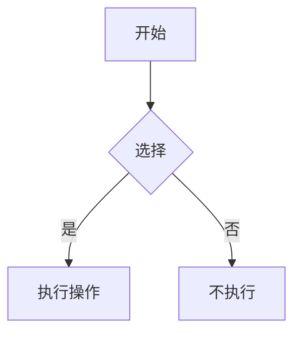

# MD Render

[English README](./README.md)

**一个本地优先、AI 驱动的中文创作工作台。**

基于 **React + Vite + Electron** 构建。产品已从 Markdown 渲染器演进为围绕「今日安排 → 内容创作 → 知识沉淀 → 多渠道发布」的一体化工作台；底层仍保留自研 CommonMark / GFM 解析渲染管线（`packages/markdown-core`），并提供 macOS 桌面应用（`apps/editor`）与可在浏览器 / GitHub Pages 运行的 Web 版。

| | |
|---|---|
| **面向用户** | 公众号 / 博客作者 · 独立内容创作者 · 需要「写 + 管 + 发」的知识工作者 |
| **关键词** | 本地优先 · AI 驱动 · 今日驱动 · 写作优先 · 发布友好 |
| **当前版本** | `1.0.12` — [发布流程](./docs/release-process.md) |
| **产品路线** | [docs/content-creation-roadmap.md](./docs/content-creation-roadmap.md) |

产品目标是把 **安排 → 收集 → 写作 → 改写 → 定稿 → 发布** 串成一条主路径：今日速记管今天的事，编辑器写长文，AI 助手改稿并直接操作界面，知识库承接沉淀，微信 / Notion 负责对外输出。

---

## 已具备能力

### 今日速记

- 按日管理 **任务**、**笔记**、**日程**，以及跨天保留的 **待办池**
- 任务支持优先级（高 / 中 / 低）与类别标注（工作、创作、学习、生活、个人）
- 日期切换、跨天结转（carryOver）、内联快速添加
- 桌面端可同步到本地磁盘（Electron）

### AI 助手

- Cowork 式助手面板：对话中可直接读写文档、切换界面、操作今日速记
- 段落级写作动作：压缩、扩写、润色、提纲、续写、标题建议、改语气、提炼要点等
- 平台版本生成：公众号、小红书、知乎等渠道改写
- 文档工作区偏创作助手；总览、Daily、看板等非文档界面偏工作台助手

### 写作与预览

- CommonMark / GFM：标题、列表、引用、表格、删除线、图片、链接
- 实时预览、编辑 / 预览切换、目录面板
- 代码块 **Shiki** 语法高亮，支持一键复制
- Mermaid 图表预览与全屏查看
- 浅色 / 深色 / 跟随系统主题
- 纸张感编辑体验：界面退后，正文优先（见 [docs/editor-philosophy.md](./docs/editor-philosophy.md)）

### 工作区与知识库

- 侧栏文件树、Obsidian 风格标签页；多视图：创作首页、当前内容、画布、图谱、搜索等
- **Web 版：** `localStorage` 持久化
- **桌面版：** SQLite + FTS5 全文搜索、版本历史、`.md` 磁盘同步
- 双向链接（`[[文档名]]`）、反向链接、关系图谱
- 书签导入；非 Markdown 文件预览（Office、PDF 等）
- 元数据筛选（状态、平台、文档类型、标签）；工作区导入 / 导出

### 发布与同步

- 微信公众号格式化，含预览弹窗与多种排版模板 — 核心差异点
- Notion 推送 / 拉取与批量同步
- 文档导出为 MD / HTML / PDF / DOCX
- 通过 GitHub Actions 部署到 GitHub Pages

### 创作工作流

- **创作首页** — 最近稿件、待办选题、素材收件箱、待发布队列；快捷新建稿件 / 选题、整理素材、跳转发布
- **选题 / 稿件看板** — 按状态分栏（选题中 → 收集中 → 草稿 → 写作中 → 待发布 / 已发布）
- **发布队列** — 待发布稿件排期、平台标签、发布前检查清单
- **灵感画布** — 卡片式白板，整理选题与素材关系
- **稿件元数据** — 六段状态流转（`idea` → `published`）、目标平台、摘要、计划发布时间、关联文档与来源素材
- **书签导入** — 书签作为一等条目，出现在素材收件箱
- **文件导入与预览** — MD / HTML / DOCX / CSV 等；Office、PDF、Excel 预览并可转为 Markdown

---

## 后续规划

详见 [内容创作工具规划](./docs/content-creation-roadmap.md)。底座与核心创作链路已具备，剩余重点：

| 缺口 | 规划方向 |
|------|----------|
| Inbox 仍为早期形态 | 统一分拣流：粘贴 / Notion 拉取 → 收件箱 → 挂选题或转草稿 |
| AI 动作质量与一致性 | 界面分流更稳、工具调用更可靠（见 [ai-assistant-quality-checklist.md](./docs/ai-assistant-quality-checklist.md)） |
| 审稿层偏薄 | 版本 diff 预览、定稿归档 |
| 云同步 | 多端只读快照与冲突策略（见 [cloud-sync-technical-plan.md](./docs/cloud-sync-technical-plan.md)） |
| 生态扩展 | Web Clipper、插件体系 |

**近期优先级：** 素材收件箱分拣 + 审稿层 + AI 助手回归质量 — 优先于插件与通用聊天大面板。

---

## 快速上手

### 安装依赖

```bash
pnpm install
```

### Web 开发

```bash
pnpm dev
```

在浏览器打开 `http://localhost:3000`，左侧编辑内容，右侧实时预览。

### 桌面开发（Electron）

```bash
pnpm electron:dev
```

依赖变更后，原生模块（`better-sqlite3`）可能需要重新编译：

```bash
pnpm --filter @md-render/editor electron:rebuild
```

### 构建

```bash
# Web 构建产物 → apps/editor/dist/
pnpm build

# macOS 桌面应用 → apps/editor/release/
pnpm electron:build

# 本地预览 Web 构建（默认 http://localhost:4173）
pnpm preview
```

## 常用工作流

### 复制到微信公众号

1. 在编辑器中编写或粘贴 Markdown。
2. 在 **设置 → 排版风格** 中选择模板。
3. 点击预览区顶部的 **复制到微信公众号**（或打开微信预览弹窗）。
4. 将转换后的 HTML 粘贴到公众号编辑器。

注意事项：

- 代码块会转换为公众号兼容的 `<pre><code>` 格式。
- HTTP 图片链接会尽可能升级为 HTTPS。
- 会移除自定义 `class` 和 `data-*` 属性以确保兼容性。
- 转换逻辑见 `apps/editor/renderer/src/utils/wechatCopy.js`，模板见 `wechatTemplates.js`。

### 工作区存储模式

| 模式 | 数据存放位置 | 适用场景 |
|------|--------------|----------|
| 临时工作区（Web） | 浏览器 `localStorage` | 快速记笔记、在线演示 |
| 桌面应用 | SQLite + 磁盘 `.md` 备份 | 大型文库、知识库、今日速记 |

在 **设置 → 工作区** 中导入 / 导出工作区数据。

### Notion 同步

1. 打开 **设置 → Notion**，填写集成 Token。
2. 将文档关联到 Notion 页面，然后推送或拉取块内容。
3. 可在 Notion 面板或 **渠道同步** 中进行批量同步。

API 细节见 `apps/editor/renderer/src/utils/notionService.js`。

## 测试

```bash
# 单元测试（Vitest）
pnpm test:unit

# 端到端测试（Playwright）— 请先在另一终端启动 dev
pnpm dev
pnpm test:e2e

# 交互式 Playwright UI
pnpm test:e2e:ui
```

E2E 测试默认假定应用运行在 `http://localhost:3000`。

## Mermaid 图表

使用 `mermaid` 语言标记的围栏代码块：

````markdown

```mermaid
graph TD
  A[开始] --> B{选择}
  B -->|是| C[执行操作]
  B -->|否| D[不执行]
```
````

- 通过 CDN 加载 Mermaid，每次预览更新后重新渲染。
- 主题跟随应用的浅色 / 深色设置。
- 鼠标悬停图表显示全屏按钮；按 Esc 或点击遮罩关闭。

## 项目结构

```
md-render/
├── package.json              # workspace 脚本与版本号
├── pnpm-workspace.yaml
├── scripts/
│   └── release-tag.sh        # 版本 tag 辅助脚本
├── docs/                     # 产品与架构文档
├── apps/
│   └── editor/
│       ├── main/             # Electron 主进程（IPC、SQLite、文件系统）
│       ├── renderer/         # React UI（Vite）
│       ├── tests/            # Vitest + Playwright
│       ├── dist/             # Web 构建输出
│       └── release/          # 桌面应用构建输出
├── packages/
│   └── markdown-core/
│       └── src/
│           ├── parser.js     # Markdown → tokens
│           ├── renderer.js   # tokens → HTML
│           └── index.js
├── README.md
├── README.zh.md
└── ARCHITECTURE.md           # 解析 / 渲染原理
```

## 支持的 Markdown 语法

### 块级元素

- `# 标题` — H1–H6
- `` ```代码块```` — 围栏代码块（语言标记启用高亮）
- `> 引用` — 引用块（支持多行）
- `- 列表项` / `1. 列表项` — 无序 / 有序列表（缩进嵌套）
- `---` / `***` / `___` — 水平分割线
- GFM 表格

### 行内元素

- `**粗体**`、`*斜体*`、`***粗斜体***`、`~~删除线~~`
- `` `代码` ``、`[链接](url)`、`[链接](url "标题")`
- ``、``
- `[[文档名]]` — 双向链接（知识库）

## 技术栈

| 层级 | 选型 |
|------|------|
| UI | React 18、Ant Design 5、lucide-react |
| 构建 | Vite 5、pnpm workspace |
| 桌面 | Electron 33、electron-builder |
| 状态 | Zustand（persist） |
| Markdown 核心 | 自研 parser / renderer（`packages/markdown-core`） |
| 代码高亮 | Shiki |
| 图表 | Mermaid（CDN） |
| 富文本 | BlockNote |
| AI | Agent 引擎 + 工具注册表（`core/agent/`） |
| 存储 | localStorage（Web）· SQLite + FTS5（桌面） |

解析 / 渲染原理详见 [ARCHITECTURE.md](./ARCHITECTURE.md)。

## 文档索引

| 主题 | 文档 |
|------|------|
| **内容创作路线图** | [docs/content-creation-roadmap.md](./docs/content-creation-roadmap.md) |
| 今日速记类别说明 | [docs/daily-notebook-task-category.md](./docs/daily-notebook-task-category.md) |
| AI 助手验收清单 | [docs/ai-assistant-quality-checklist.md](./docs/ai-assistant-quality-checklist.md) |
| 知识库实施进度 | [docs/knowledge-base-progress.md](./docs/knowledge-base-progress.md) |
| 知识库专项路线 | [docs/knowledge-base-roadmap.md](./docs/knowledge-base-roadmap.md) |
| 编辑器设计哲学 | [docs/editor-philosophy.md](./docs/editor-philosophy.md) |
| 版本发布流程 | [docs/release-process.md](./docs/release-process.md) |
| 解析 / 渲染原理 | [ARCHITECTURE.md](./ARCHITECTURE.md) |
| Agent / 开发规范 | [AGENTS.md](./AGENTS.md) |

## 版本发布

版本号维护在根目录 `package.json`：

```bash
# 1. 修改 package.json 中的 version 并提交
# 2. 预览 tag
pnpm release:tag -- --dry-run
# 3. 创建 annotated tag 并推送
pnpm release:tag
```

完整检查清单见 [docs/release-process.md](./docs/release-process.md)。

## 部署到 GitHub Pages

`apps/editor` 的 Web 构建产物可通过 GitHub Actions 部署到 GitHub Pages。

### 一次性配置

1. 在 GitHub 仓库中打开 **Settings → Pages**。
2. 将 **Source** 设置为 **GitHub Actions**。
3. 确认默认分支为 `main`（或按实际情况调整工作流）。

### 自动部署

- 工作流：`.github/workflows/deploy-pages.yml`
- 推送到 `main` 时自动构建部署；也可在 Actions 页签手动触发。
- CI 中 Vite `base` 自动推断为 `/<repo>/`，本地开发仍为 `/`。

### 访问地址

- 个人站点：`https://<username>.github.io/`
- 项目页：`https://<username>.github.io/<repo>/`

若 Pages 上出现静态资源 404，请确认 CI 设置了正确的 Vite `base`（本仓库通过 `GITHUB_REPOSITORY` 自动推断）。

## 变更记录（摘要）

### v1.0.x — AI 驱动的创作工作台

在创作底座之上，补齐 Daily、AI 助手与创作看板：

- **今日速记**：任务 / 笔记 / 待办池、优先级与类别、跨天结转
- **AI 助手**：段落改写、平台版本、界面切换与工作区操作
- **创作看板 & 发布队列**：状态分栏、排期与发布前清单
- **知识库 P1 完成**：SQLite、FTS5、双向链接、反向链接、图谱、版本历史
- 微信格式化、Notion 同步、书签导入、多格式导出、灵感画布

下一步见 [路线图 §7–§8](./docs/content-creation-roadmap.md)：素材收件箱分拣、审稿层、AI 助手质量回归。

### v2.1 — 目录与本地存储

- 目录侧栏与多级文件夹；自动保存至 `localStorage`

### v2.0 — CommonMark / GFM

- 删除线、图片、链接 title、多行引用、表格

### v1.3 — 代码块增强

- 复制按钮、语法高亮、VS Code 风格代码块头部

### v1.2 — 嵌套列表

- 多级嵌套与有序 / 无序混排
