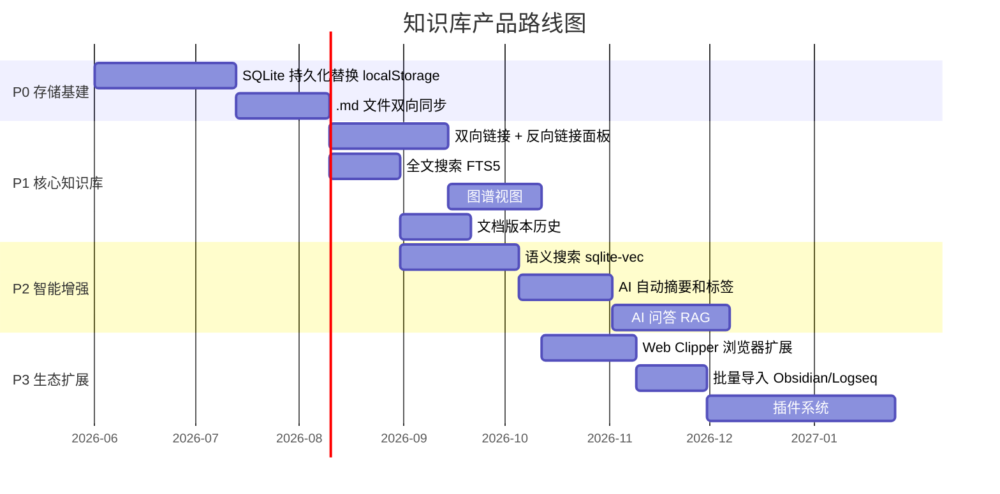
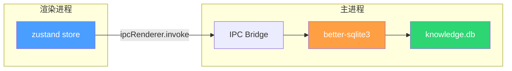
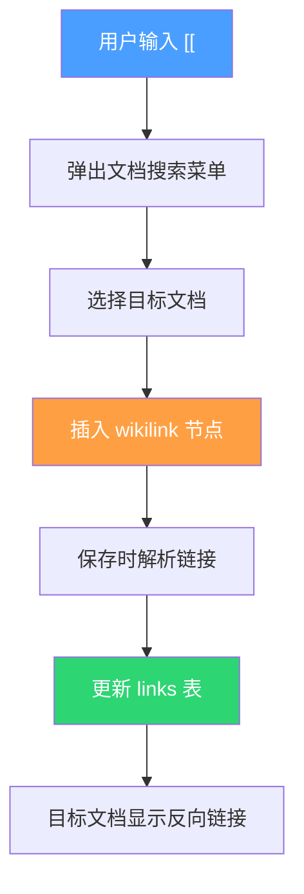
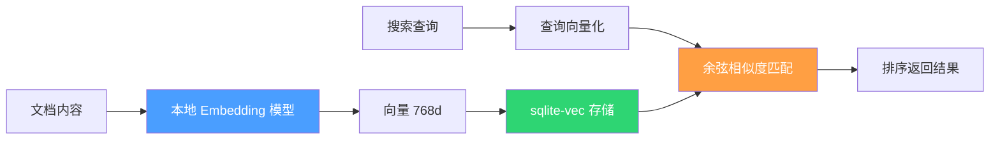
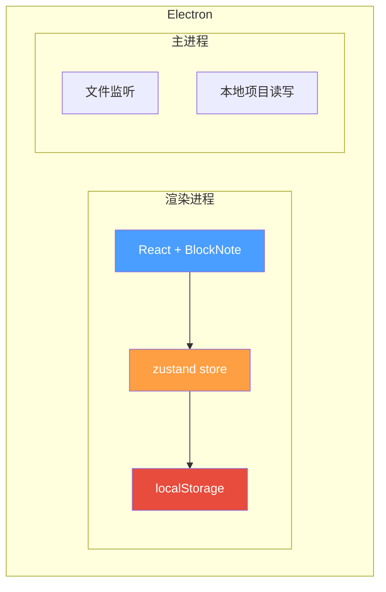

# md-render 知识库产品规划

> 定位：**本地优先的个人知识管理工具**，从现有 Markdown 编辑器演进，目标对标 Obsidian / Logseq，差异化在于**微信/Notion 一键发布 + 中文内容创作者友好**。

---

## 1. 现状盘点

### 1.1 已有能力

| 能力 | 模块 | 成熟度 |
|------|------|--------|
| Markdown 编辑 + 实时预览 | `MarkdownEditor` + `markdown-core` | ✅ 生产可用 |
| 文件树 + 文件夹管理 | `WorkspaceSidebar` + `workspaceUtils` | ✅ 生产可用 |
| 本地项目挂载 + 文件监听 | `localProject` + `localProjectWatcher` | ✅ 生产可用 |
| 微信公众号格式化 | `wechatCopy` + `wechatTemplates` | ✅ 生产可用 |
| Notion 同步导出 | `notionService` + `notionConverter` | ✅ 生产可用 |
| 标签系统 | `TagBar` + store `tags` 字段 | ✅ 基础可用 |
| 知识元数据（类型/摘要/别名/关联） | `KnowledgeMetaPanel` + `knowledgeFields` | ⚠️ 初步框架 |
| 关键词搜索 | `KnowledgeBasePanel` 内搜索 | ⚠️ 简单实现 |
| 小说实体提取 | `core/novel/` | ✅ 生产可用 |
| Electron 桌面端 | `main.js` + `preload.js` | ✅ 生产可用 |

### 1.2 缺失能力（做知识库必须补的）

- **双向链接**：文档间 `[[]]` 引用 + 反向链接面板
- **图谱视图**：可视化文档关联关系
- **全文搜索**：当前仅前端内存搜索，大量文档时性能差
- **持久化存储**：localStorage 有 5~10MB 上限，文档多了会爆
- **版本历史**：无法回退到旧版本
- **导入能力**：无法批量导入外部 Markdown 文件
- **Web Clipper**：无法从浏览器剪藏内容

### 1.3 架构约束

- 纯 JavaScript，不引入 TypeScript
- 全局状态统一走 `useEditorStore.js`（zustand）
- 样式走 CSS 变量，颜色从 `design-tokens.css` 取
- 核心解析渲染保持纯函数

---

## 2. 产品定位与竞品分析

### 2.1 目标用户画像

**中文内容创作者**：写公众号文章、技术博客、个人笔记，需要一个地方统一管理知识，写完直接发布。

### 2.2 竞品对比

| 维度 | Obsidian | Logseq | 思源笔记 | md-render（目标） |
|------|----------|--------|----------|-------------------|
| 编辑模式 | 文档 | 大纲块 | 块级 | 文档（BlockNote） |
| 数据存储 | 本地 .md | 本地 .md | 本地数据库 | 本地 SQLite + .md |
| 双向链接 | ✅ | ✅ | ✅ | 🔜 P1 |
| 图谱视图 | ✅ | ✅ | ✅ | 🔜 P1 |
| 全文搜索 | ✅ | ✅ | ✅ | 🔜 P1 |
| 语义搜索 | 插件 | ❌ | ❌ | 🔜 P2 |
| 微信发布 | ❌ | ❌ | ❌ | ✅ **独有** |
| Notion 同步 | 插件 | ❌ | ❌ | ✅ **独有** |
| 插件生态 | 1500+ | 较少 | 集市 | 🔜 P3 |
| 中文优化 | 一般 | 一般 | ✅ | ✅ **原生** |

### 2.3 差异化定位

> **写得好、管得住、发得出** —— 唯一原生支持「创作→管理→发布」全链路的个人知识库。

---

## 3. 分阶段路线图

### 3.1 整体节奏



---

### 3.2 P0：存储基建（约 10 周）

**为什么先做这个？** localStorage 有 5~10MB 上限，100 篇长文就会爆。做任何知识库功能前必须先解决存储瓶颈。

#### 3.2.1 SQLite 持久化

**方案**：Electron 主进程引入 `better-sqlite3`，替换 localStorage 存储工作区数据。



**数据模型**：

```sql
-- 文档表
CREATE TABLE documents (
  id TEXT PRIMARY KEY,
  parent_id TEXT,
  type TEXT NOT NULL DEFAULT 'file',  -- file | folder
  name TEXT NOT NULL,
  content TEXT,
  node_type TEXT DEFAULT 'document',  -- concept | method | tech | component | document
  summary TEXT,
  aliases TEXT,          -- JSON array
  tags TEXT,             -- JSON array
  related_ids TEXT,      -- JSON array
  created_at INTEGER,
  updated_at INTEGER
);

-- 全文搜索虚拟表
CREATE VIRTUAL TABLE documents_fts USING fts5(
  name, content, summary, aliases, tags,
  content=documents,
  content_rowid=rowid,
  tokenize='unicode61'   -- 后续可换 jieba 分词
);

-- 双向链接表
CREATE TABLE links (
  source_id TEXT NOT NULL,
  target_id TEXT NOT NULL,
  context TEXT,           -- 链接出现的上下文片段
  PRIMARY KEY (source_id, target_id)
);

-- 版本历史表
CREATE TABLE versions (
  id INTEGER PRIMARY KEY AUTOINCREMENT,
  document_id TEXT NOT NULL,
  content TEXT,
  created_at INTEGER,
  FOREIGN KEY (document_id) REFERENCES documents(id)
);
```

**改动范围**：
- 新增：`apps/editor/main/database.js` — SQLite 封装层
- 修改：`useEditorStore.js` — 持久化中间件从 localStorage 切换到 IPC
- 修改：`main.js` — 注册 IPC handlers
- 保持：`workspaceUtils.js` 纯函数不动，仅换数据来源

**迁移策略**：首次启动检测 localStorage 有数据 → 自动迁移到 SQLite → 迁移成功后清除 localStorage。

#### 3.2.2 .md 文件双向同步

**现有能力**：已有 `localProject` 系列模块支持本地项目挂载和文件监听。

**补充**：在 SQLite 层增加 `disk_path` 字段，支持 SQLite ↔ .md 文件的双向同步，保证用户数据始终是可读的纯文本文件。

---

### 3.3 P1：核心知识库能力（约 15 周）

#### 3.3.1 双向链接

**实现思路**：

1. **编辑器层**：在 BlockNote 中注册 `[[` 触发的 mention 补全（类似现有小说实体的 `NovelMentionMenu`），用户输入 `[[` 弹出文档列表。
2. **解析层**：`parser.js` 新增 `wikilink` token 类型，匹配 `[[文档名]]` 或 `[[文档名|显示文本]]`。
3. **存储层**：每次保存文档时，解析内容中的 `[[]]` 链接，更新 `links` 表。
4. **UI 层**：在 `KnowledgeMetaPanel` 中新增「反向链接」区域，展示所有链接到当前文档的其他文档。



**可复用**：`NovelMentionMenu` 的 mention 交互模式可以直接复用，改成搜索全部文档即可。

#### 3.3.2 全文搜索（FTS5）

**方案**：利用 P0 建好的 `documents_fts` 虚拟表，搜索走主进程 IPC。

- 搜索请求：渲染进程 → IPC → 主进程 SQL 查询 → 返回结果 + 高亮片段
- 中文分词：初期用 `unicode61`（按 Unicode 字符边界分词，中文每个字独立索引），后续可接入 `jieba` 分词提升效果
- UI 改造：现有 `KnowledgeBasePanel` 中的搜索逻辑从前端内存过滤改为调用 IPC

#### 3.3.3 图谱视图

**方案**：基于 `links` 表 + `related_ids` 构建图数据，用 `d3-force` 渲染力导向图。

- 节点 = 文档，边 = 链接关系
- 现有 `KnowledgeBasePanel` 中已有 `GRAPH_NODE_LAYOUTS` 的静态图谱占位，替换为动态 d3 图
- 支持缩放、拖拽、点击节点跳转文档

#### 3.3.4 文档版本历史

**方案**：每次保存时，如果内容变化超过阈值（如 diff > 50 字符），写入 `versions` 表。UI 提供时间线查看和一键恢复。

---

### 3.4 P2：智能增强（约 14 周）

#### 3.4.1 语义搜索

**方案**：`sqlite-vec` 扩展 + 本地 embedding 模型。



- Embedding 模型：优先选 `all-MiniLM-L6-v2` 或中文优化的 `text2vec-base-chinese`，通过 ONNX Runtime 在 Electron 中本地运行
- 混合搜索：FTS5 关键词得分 + sqlite-vec 语义得分加权合并，兼顾精确匹配和模糊语义

#### 3.4.2 AI 自动摘要 & 标签

- 接入 LLM API（OpenAI / Claude / 本地模型），文档保存时自动生成摘要和推荐标签
- 现有 `KnowledgeMetaPanel` 的 summary 和 tags 字段已就绪，只需填充数据

#### 3.4.3 AI 问答（RAG）

- 用户在搜索框输入自然语言问题 → 语义检索 top-k 相关文档 → 拼接为 context → LLM 生成回答并标注出处
- 这是「知识从被动查变主动推」的关键功能

---

### 3.5 P3：生态扩展（约 15 周）

| 功能 | 说明 |
|------|------|
| Web Clipper | Chrome 扩展，一键剪藏网页到知识库 |
| 批量导入 | 支持 Obsidian vault / Logseq graph / 纯 .md 目录导入 |
| 插件系统 | 开放 API，允许第三方扩展编辑器和发布渠道 |

---

## 4. 技术架构演进

### 4.1 当前架构



### 4.2 目标架构

```mermaid
flowchart TD
    subgraph Electron
        subgraph 渲染进程
            A["React + BlockNote"]
            B["zustand store"]
            C["IPC 数据层"]
        end
        subgraph 主进程
            D["IPC Router"]
            E["Database Layer"]
            F["better-sqlite3"]
            G["sqlite-vec"]
            H["FTS5"]
            I["File Sync"]
            J["Embedding Engine"]
        end
        subgraph 存储
            K[("knowledge.db")]
            L["📁 .md 文件")]
        end
    end

    A --> B --> C
    C -->|IPC| D
    D --> E
    E --> F & G & H
    F --> K
    G --> K
    H --> K
    D --> I --> L
    D --> J

    style A fill:#4a9eff,color:#fff
    style E fill:#ff9f43,color:#fff
    style K fill:#2ed573,color:#fff
    style L fill:#2ed573,color:#fff
```

### 4.3 关键技术选型

| 领域 | 选型 | 理由 |
|------|------|------|
| 持久化 | better-sqlite3 | Electron 生态成熟，同步 API 简单，支持扩展 |
| 全文搜索 | SQLite FTS5 | 内置、零依赖、性能好 |
| 向量搜索 | sqlite-vec | 与 SQLite 无缝集成，单文件、零服务 |
| 图可视化 | d3-force | 轻量灵活，不引入重框架 |
| Embedding | ONNX Runtime | 本地运行，隐私友好，无需联网 |
| 双向链接解析 | parser.js 扩展 | 复用现有解析器架构，保持纯函数 |

---

## 5. 风险与应对

| 风险 | 影响 | 应对 |
|------|------|------|
| localStorage → SQLite 迁移数据丢失 | 高 | 迁移前自动备份 JSON，迁移后校验文档数 |
| 中文 FTS 分词效果差 | 中 | 初期用 unicode61，后续接 jieba；语义搜索兜底 |
| Embedding 模型体积大（~100MB） | 中 | 语义搜索作为可选功能，首次使用时下载 |
| better-sqlite3 与 Electron 版本兼容 | 中 | 锁定已验证的版本组合，CI 中测试 |
| BlockNote 扩展 wikilink 的复杂度 | 中 | 先做纯文本 `[[]]`，再做富文本块 |

---

## 6. 成功指标

**P0 完成标准**：
- 1000 篇文档无性能问题（localStorage 上限 ~100 篇）
- 新老数据无损迁移

**P1 完成标准**：
- 双向链接可正确解析和展示反向链接
- 全文搜索 < 100ms（1000 篇文档）
- 图谱可渲染 500+ 节点

**P2 完成标准**：
- 语义搜索可找到关键词不匹配但语义相关的文档
- AI 摘要准确率 > 80%（人工抽检）

---

## 7. 下一步行动

1. **立即开始 P0**：创建 `apps/editor/main/database.js`，搭建 SQLite 封装层
2. **验证技术风险**：用 POC 验证 better-sqlite3 + Electron 的兼容性
3. **设计迁移方案**：写 localStorage → SQLite 的自动迁移脚本并覆盖测试

---

*文档版本：v1.0 | 更新日期：2026-06-04*
