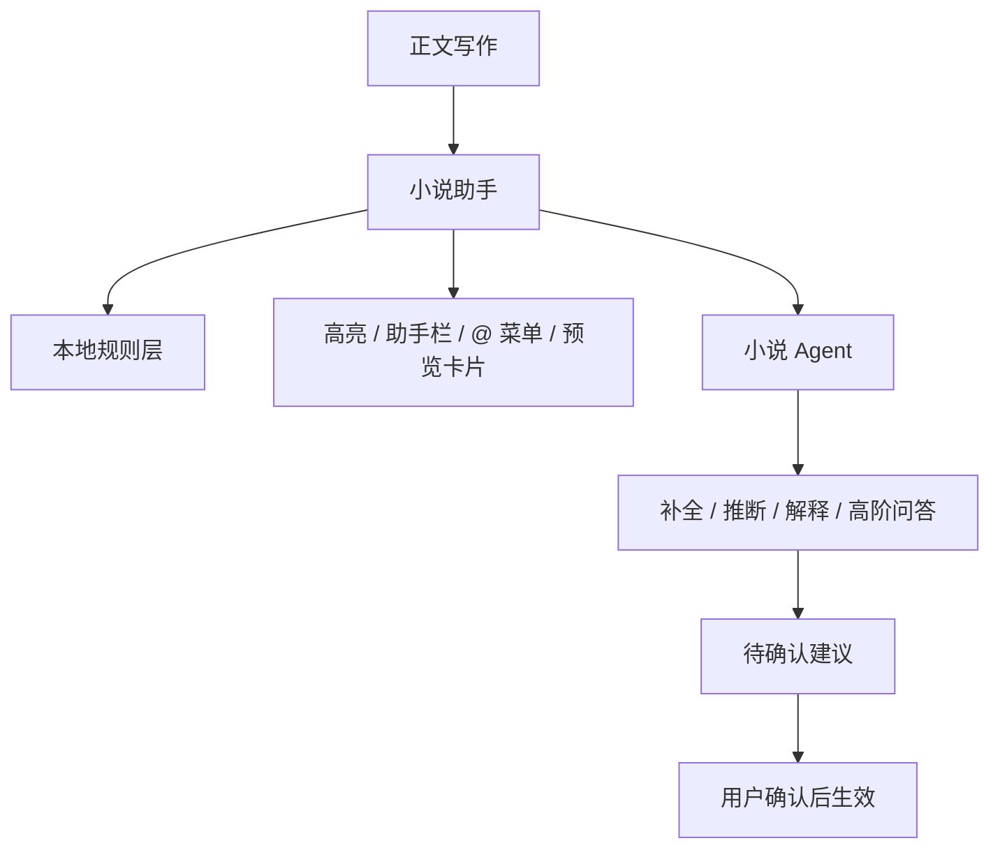

# 小说助手与 Agent 边界说明

本文档单独说明小说模式里，哪些能力适合定义为 Agent，哪些能力不适合，以及两者在产品架构中的分工关系。

这份文档的目标不是讨论模型能力本身，而是明确：

- 什么应该留在编辑器本地层
- 什么应该交给 Agent 推理层
- 为什么要这样分层

---

## 1. 结论先行

更合适的定义不是“整个小说助手就是 Agent”，而是：

- 小说助手：产品形态
- 小说 Agent：能力内核

两者关系：

- 小说助手是编辑器里的常驻工作台，负责实时、稳定、低打扰的辅助体验。
- 小说 Agent 是按需调用的推理引擎，负责理解、补全、解释和高阶分析。

一句话总结：

**助手负责陪写，Agent 负责推理。**

---

## 2. 为什么不能把整个助手都定义成 Agent

如果把整个小说助手都理解为 Agent，会带来几个问题：

- 实时写作体验会被模型延迟影响
- 用户会感觉“每输入一点都在等 AI 思考”
- 编辑器的基础反馈变得不可预测
- 简单规则问题被错误地升级成智能问题，系统成本和复杂度都上升

小说模式首先服务的是连续写作，所以最重要的是：

- 快
- 稳
- 不打断

而这三点恰恰要求一部分能力必须留在本地。

---

## 3. 适合留在小说助手本地层的能力

这类能力的共同特征是：

- 需要实时反馈
- 结果相对确定
- 主要依赖规则、状态和已有结构数据
- 必须弱打扰

适合放在本地助手层的能力包括：

### 3.1 实体识别

例如：

- 识别角色名
- 识别地点名
- 识别势力名
- 识别物件和任务线索

原因：

- 这是输入过程中的基础反馈，必须足够快
- 规则和共现统计已经可以完成大部分 v1 需求

### 3.2 场景抽取

例如：

- 根据标题、分隔线、时空切换词切分场景
- 更新当前场景摘要

原因：

- 这是对文档结构的即时理解
- 不需要复杂推理也能得到稳定结果

### 3.3 正文实体高亮

例如：

- 角色、地点、势力、物件、任务在正文中高亮
- 点击实体打开预览卡片

原因：

- 这是纯前端可视化能力
- 必须立即响应，不能依赖 Agent 返回

### 3.4 `@` 实体引用菜单

例如：

- 输入 `@` 打开实体分类菜单
- 工具栏点击“实体引用”直接拉起同一个菜单

原因：

- 这是输入辅助，不是推理任务
- 必须稳定、可预测、低延迟

### 3.5 实体卡展示与手动编辑

例如：

- 展示实体名称、类型、别名、摘要、特征
- 用户手动修正实体字段

原因：

- 这是结构化信息的管理界面
- 不应该绑定到 Agent 的生成时机

### 3.6 基于规则的冲突提示

例如：

- 同一地点出现两个不同名称
- 同一人物的称呼疑似不一致

原因：

- 先做“可能冲突”的本地提示更稳妥
- 提示本身不需要复杂生成

---

## 4. 适合交给小说 Agent 的能力

这类能力的共同特征是：

- 需要上下文理解
- 需要推理、归纳或补全
- 结果不是唯一确定
- 适合作为建议，而不是自动执行

适合交给 Agent 的能力包括：

### 4.1 补全当前场景

例如：

- 总结当前场景的目标、冲突、张力
- 提取当前场景的未回收线索

原因：

- 这是抽象和归纳任务
- 需要比规则更强的语义理解

### 4.2 推断别名关系

例如：

- “沈临川”和“沈兄”是否是同一人
- “顾执事”和“顾照霜”是否应该合并

原因：

- 别名判断依赖上下文和语气
- 不能只靠字符串相似度直接合并

### 4.3 解释设定冲突

例如：

- 为什么系统认为这个地点名称冲突
- 为什么两段描述可能对应同一人物

原因：

- 用户需要的不是一个红点，而是“为什么”
- 这更适合 Agent 生成解释型建议

### 4.4 补全人物卡 / 地点卡 / 势力卡

例如：

- 根据近期片段补一段人物简介
- 推断某个地点当前的功能和气质

原因：

- 这是典型的“从非结构化文本生成结构化信息”
- 应作为建议进入待确认区，而不是直接写入

### 4.5 回答高阶问题

例如：

- 这个人物和谁关系最深
- 这条伏笔是否还没有回收
- 这一章的主要冲突线是什么

原因：

- 这是带问题目标的理解任务
- 已经超出本地规则层的职责范围

---

## 5. 不适合交给 Agent 的事情

即便接入 Agent，也有一些事不应该交给它：

### 5.1 不应让 Agent 接管基础编辑流程

例如：

- 用户每次输入都触发 Agent
- 用户每次点击实体都等待 Agent 返回
- `@` 菜单依赖 Agent 现算结果

原因：

- 会直接破坏写作流畅度
- 会让基本交互变得不稳定

### 5.2 不应让 Agent 自动改正文

例如：

- 自动替换角色名称
- 自动把称呼合并为同一实体
- 自动插入设定描述

原因：

- 小说正文是最高优先级内容
- Agent 只能建议，不能越权改写

### 5.3 不应让 Agent 覆盖用户手改字段

例如：

- 用户手动写的角色摘要被重新生成覆盖
- 用户确认过的别名关系被重新改写

原因：

- 用户手工确认后的信息优先级必须最高
- Agent 只能补充，不能抢所有权

---

## 6. 推荐的产品定义

更推荐的产品表述是：

- 小说模式里有一个“小说助手”
- 小说助手背后接了一个“小说 Agent”

分层关系如下：

其中：

- 小说助手是用户长期可见的工作台
- 小说 Agent 是一个按需介入的后台能力
- 本地层负责实时反馈
- Agent 层负责高价值推理

---

## 7. 推荐触发原则

小说 Agent 不应常驻抢焦点，而应在以下时机介入：

- 本地识别置信度低
- 出现疑似别名
- 出现疑似设定冲突
- 用户主动点击“补全当前场景”
- 用户主动点击“补全设定卡”
- 用户主动提问某个高阶问题

不推荐的触发方式：

- 每次输入字符都调用
- 每次停顿都强制调用
- 每次点击实体都自动生成内容

---

## 8. 数据与权限边界

为了保证小说模式可控，Agent 层应遵守以下边界：

- 只读取必要上下文，不默认读取整个工作区全文
- 优先传当前场景片段 + 相关实体卡
- 结果只进入建议队列
- 不自动写正文
- 不自动覆盖用户确认过的字段

这意味着：

- Agent 的输出是“候选理解”
- 用户确认后的内容才是“正式设定”

---

## 9. 最终判断标准

判断一个能力该不该做成 Agent，可以用下面四个问题：

1. 它是否要求实时、无延迟反馈？
2. 它是否主要依赖确定性规则而不是推理？
3. 它是否属于输入过程中的基础能力？
4. 它是否一旦出错就会直接打断写作？

如果大多数答案是“是”，它更应该留在小说助手本地层。

再问另外四个问题：

1. 它是否需要上下文理解和归纳？
2. 它是否更像补全、解释或判断？
3. 它的结果是否天然是建议而不是唯一正确答案？
4. 它是否适合由用户最后确认？

如果大多数答案是“是”，它更适合交给小说 Agent。

---

## 10. 一句话版本

不要把整个小说助手都做成 Agent。

更合理的结构是：

**用本地助手守住写作流，用 Agent 提供高价值推理。**
