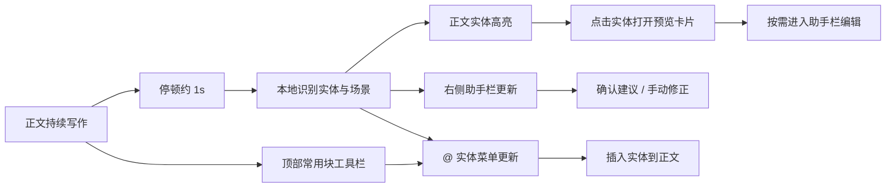

# 小说模式设计文档

本文档沉淀小说模式在当前编辑器中的目标、交互边界、视觉约束和已确认实现结论。

目标不是做一个“写小说专用后台”，而是在现有纸面编辑器里加入一层弱打扰的设定辅助，让设定在写作过程中自然长出来。

---

## 1. 设计目标

小说模式服务的是“连续写作”而不是“先搭设定表再开始写”。

核心目标：

- 不改变正文编辑主路径，用户仍然直接写内容。
- 在用户停顿时自动识别角色、地点、势力、物件、任务、场景。
- 让结构化设定在后台持续生长，但不强迫用户先补全大纲。
- 所有 AI 和自动识别结果都只进入建议层，不直接改正文。

一句话总结：

**边写边长设定，助手存在但不抢主角。**

---

## 2. 产品定位

### 2.1 模式定位

小说模式是工作区级模式，不是一个独立的新编辑器。

- 默认仍是普通模式。
- 开启后保留原有 BlockNote 编辑体验。
- 额外增加右侧小说助手栏、正文实体高亮、`@` 实体插入。

### 2.2 用户心智

用户面对的仍然是一张纸，而不是一个“小说管理系统”。

因此小说模式必须满足：

- 主视觉仍然是正文。
- 助手信息在旁边，不压到正文上方。
- 结构化信息是辅助理解，不是主要工作流。

### 2.3 小说助手与小说 Agent 的分层

“小说助手”更适合作为产品形态，“小说 Agent”更适合作为能力内核。

推荐定义：

- 前台叫“小说助手”
- 后台推理层叫“小说 Agent”

两者关系：

- 小说助手是编辑器里的常驻工作台，负责承接实时识别、展示、确认和轻交互。
- 小说 Agent 是按需调用的推理引擎，负责更复杂的理解、补全和解释。

这样分层的原因：

- 实时写作体验不能被 Agent 延迟拖慢。
- 编辑器中的基础反馈必须稳定、可预测、弱打扰。
- 推理、补全、总结这类高价值动作更适合交给 Agent。

---

## 3. 交互结构



### 3.1 主编辑区

- 保持当前纸面写作布局。
- 实体在正文中以轻量高亮出现。
- 点击高亮实体后，优先打开一张正文上的实体预览卡片，而不是强制展开右侧助手栏。
- 预览卡片以“快速查看”为主，不承担重编辑职责。

### 3.1.1 顶部常用块工具栏

在文档标题下方增加一条轻量常用块工具栏，用于承接 slash 菜单里最高频的块操作。

当前保留项：

- H1
- H2
- 引用
- 无序列表
- 有序列表
- 分割线
- 实体引用

当前明确不放入固定工具栏的项：

- 正文
- 待办
- 代码块

设计原则：

- 只放高频且稳定的块级操作。
- 不试图完整替代 slash 菜单。
- 保持横向轻量，不做重型后台工具条。

### 3.2 右侧助手栏

固定包含以下分区：

- 当前场景
- 实体详情
- 快捷插入
- 实体卡
- 待确认

设计原则：

- 默认不抢焦点。
- 可收起。
- 所有内容都是“看得见但不强迫处理”。

### 3.3 `@` 实体菜单

实体插入统一使用 `@`，不占用 slash 菜单。

分工如下：

- `/`：保留编辑器原生块级操作
- `@`：小说实体插入和提及
- 顶部工具栏里的“实体引用”：直接拉起 `@` 菜单，是 `@` 的显式入口而不是第二套系统

`@` 弹窗采用双栏结构：

- 左侧：分类导航
- 右侧：当前分类实体列表

分类固定为：

- 全部
- 角色
- 地点
- 势力
- 物件
- 任务

### 3.4 正文实体预览卡片

点击正文里的高亮实体后，应弹出一张预览卡片。

交互定位：

- 这是一个“阅读态浮层”，不是编辑面板。
- 用户主要在这里快速确认实体是什么、当前状态如何、在文档中被提及了多少次。
- 关闭后应立即回到原写作上下文。

当前展示信息：

- 实体类型
- 实体名称
- 状态
- 总提及次数
- 简介
- 别名
- 特征
- 当前文档提及
- 来源文档

当前明确不放入卡片底部的动作：

- 插入到正文
- 在助手中查看

原因：

- 正文点击后的第一目标是“看”，不是“立即操作”。
- 底部动作会把这张卡片从阅读态拉回工具态。
- 插入实体已有 `@` 菜单入口，助手栏也已有系统浏览入口，没必要在预览卡片里重复堆叠。

---

## 4. 实体系统设计

### 4.1 实体类型

V1 固定支持以下类型：

- `character`
- `location`
- `faction`
- `item`
- `mission`

### 4.2 实体数据结构

```ts
interface INovelEntity {
  id: string;
  type: 'character' | 'location' | 'faction' | 'item' | 'mission';
  name: string;
  aliases: string[];
  summary: string;
  traits: string[];
  relations: any[];
  mentionCount: number;
  sourceFileId: string;
  status: 'pending' | 'confirmed' | 'accepted' | 'dismissed';
}
```

### 4.3 实体呈现

实体在不同入口必须共享同一套识别语言。

统一要求：

- 正文高亮颜色按类型区分。
- 右侧实体卡和详情使用统一类型标记。
- `@` 菜单使用同一套类型标记，不单独发明另一套图标语言。
- 快捷插入、分类标题、实体详情都复用同一视觉标记体系。

当前实现中，统一标记由 `NovelEntityMark` 负责。

---

## 5. 场景与识别策略

### 5.1 本地优先

识别链路采用“本地规则优先，AI 兜底”：

- 本地规则负责实时识别和稳定反馈。
- AI 只用于补全建议、别名推断、冲突提醒、场景摘要。
- AI 输出不能直接改正文。

从能力归属上再细分：

属于小说助手本地层的能力：

- 实体识别
- 场景抽取
- 正文高亮
- `@` 菜单
- 实体卡展示
- 基于规则的冲突提示

适合交给小说 Agent 的能力：

- 补全当前场景
- 推断别名关系
- 解释设定冲突
- 补一张人物卡或地点卡
- 回答“这条伏笔是否未回收”这类高阶问题

### 5.2 实时更新规则

- 输入停顿约 1000ms 后分析当前文档。
- 切换文件时重新分析当前文件。
- 助手栏、正文高亮、`@` 菜单都基于同一份最新实体数据。
- 从外部复制 Markdown 文本进入编辑器时，应优先按 Markdown 结构解析，而不是退化成普通纯文本。

### 5.3 中文专用规则

地点线索：

- `城/镇/村/山/谷/宫/阁/殿/府/楼/院/营`

势力线索：

- `门/派/宗/司/堂/会/盟/军`

任务线索：

- `要去/必须/负责/委托/调查/寻找/护送/潜入/刺杀/救出`

场景切换线索：

- `次日/当夜/不久后/来到/回到/进入/离开`

---

## 6. 交互边界

### 6.1 自动化边界

允许自动化的内容：

- 自动识别实体
- 自动识别场景
- 自动生成建议
- 自动更新助手栏视图

不允许自动化的内容：

- 自动改写正文
- 自动替换实体名称
- 自动合并别名
- 自动覆盖用户手动修改的实体字段

### 6.2 用户确认边界

以下动作必须由用户确认：

- 接受新实体建卡
- 合并别名
- 接受冲突建议
- 接受 AI 补全内容

---

## 7. 已确认的交互结论

### 7.1 不使用 slash 插入实体

之前评估过 slash 快捷插入，但最终放弃。

原因：

- slash 属于块级编辑动作，语义更适合标题、列表、引用等结构操作。
- 实体插入更像“提及”而不是“插入块”。
- 将实体塞进 slash 会让默认菜单职责变混。

最终结论：

- slash 保持编辑器默认行为
- 实体插入统一使用 `@`

### 7.2 `@` 菜单必须支持分类浏览

仅按搜索结果平铺不够，因为小说实体数量上来后会失去可扫读性。

因此 `@` 菜单必须支持：

- 左侧分类切换
- 右侧分类内浏览
- 全部分类下按类型分段显示

### 7.3 分类切换不能被默认选中项打回

实现过程中出现过一个问题：

- 用户点击左侧分类后，菜单会“闪一下”又回到原分类。

根因：

- 菜单内部用 `selectedIndex` 同步当前分类。
- 但手动点击分类时，默认选中项并没有变化。
- 同步副作用立即把分类重置回选中项所属类型。

修正原则：

- 只有在选中项真正变化时，菜单才允许自动跟随切分类。
- 用户手动切换分类必须具有更高优先级。

### 7.4 小说模式的视觉必须回到编辑器整体语言

`@` 菜单曾经一度像“联系人选择器”，与纸面写作界面不统一。

确认后的视觉原则：

- 使用与小说助手栏一致的纸面玻璃感底板
- 使用柔和边框和轻阴影，而不是后台式强分层
- 分类按钮像侧栏卡片，而不是外部产品组件
- 实体项像轻量内容卡，而不是通讯录列表

### 7.5 正文实体点击不应强制展开右侧助手栏

正文里的高亮实体最初会直接联动右侧助手栏，但这会打断写作视线。

最终结论：

- 点击正文高亮实体，优先打开预览卡片。
- 右侧助手栏保留为系统性浏览和编辑入口。
- “查看”与“编辑”应当分层，不要合并成一次重动作。

### 7.6 顶部工具栏只承接高频块操作

实现过程中，顶部工具栏曾临时放入过“正文 / 待办 / 代码块”等项。

后续调整后的原则：

- 顶部工具栏只放 slash 菜单里最常用、最稳定的块级操作。
- 不把全部 slash 项平铺到标题下方。
- 不把低频或容易造成视觉噪音的项长期固定展示。

当前移除项：

- 正文
- 待办
- 代码块

### 7.7 工具栏里的“实体引用”必须直接拉起实体下拉

“实体引用”按钮如果只是向正文插入一个 `@` 字符，可能无法稳定触发建议菜单。

最终结论：

- 工具栏里的“实体引用”应直接调用编辑器的建议菜单扩展，主动打开 `@` 菜单。
- 不依赖输入事件是否刚好触发。
- 工具栏入口和键盘输入 `@` 必须落到同一个实体菜单系统上。

### 7.8 整个小说助手不等于 Agent

小说模式里已经有“助手”概念，但不应该把所有能力都笼统定义成 Agent。

最终结论：

- 小说助手是产品层，是用户长期可见的写作辅助界面。
- 小说 Agent 是能力层，只在需要推理时介入。
- 实时、弱打扰、可预测的反馈必须尽量留在本地助手层。
- 复杂推理、补全和解释再交给 Agent。

---

## 8. 视觉语言补充

小说模式虽然增加结构化信息，但不能破坏编辑器现有“沉浸、克制、纸面感”的总基调。

因此：

- 浮层要轻，不能过重。
- 强调色只用于实体类型识别和当前选中。
- 分类、标签、标记都应服务于扫读，不应变成视觉主角。
- 实体相关颜色要与正文高亮保持一致来源，避免一处一套色板。
- Ant Design 组件可以作为行为与结构承载，但视觉必须完全回收到当前编辑器系统语言中，不能露出默认组件气质。

当前类型色建议：

- 角色：蓝
- 地点：绿
- 势力：金黄
- 物件：紫
- 任务：红

---

## 9. 当前实现映射

当前代码中的核心落点：

- 模式状态与持久化：`src/store/useEditorStore.js`
- 小说识别层：`src/core/novel/`
- 编辑器集成：`src/components/MarkdownEditor.jsx`
- 顶部常用块工具栏：`src/components/EditorQuickToolbar.jsx`
- 小说助手栏：`src/components/NovelAssistantPanel.jsx`
- 正文实体预览卡片：`src/components/NovelEntityPreviewModal.jsx`
- `@` 分类菜单：`src/components/NovelMentionMenu.jsx`
- 实体统一标记：`src/components/NovelEntityMark.jsx`
- 视觉样式：`src/styles/styles.css`

---

## 10. 后续演进建议

下一阶段可以继续沿这套方向演进：

- `@` 菜单增加最近使用实体
- 点击正文实体后，助手栏自动滚到对应实体卡
- 实体关系增加可视化摘要
- AI 建议分成“补全信息”和“发现冲突”两类展示
- 提供“导出设定册”，但仍不默认污染文件树
