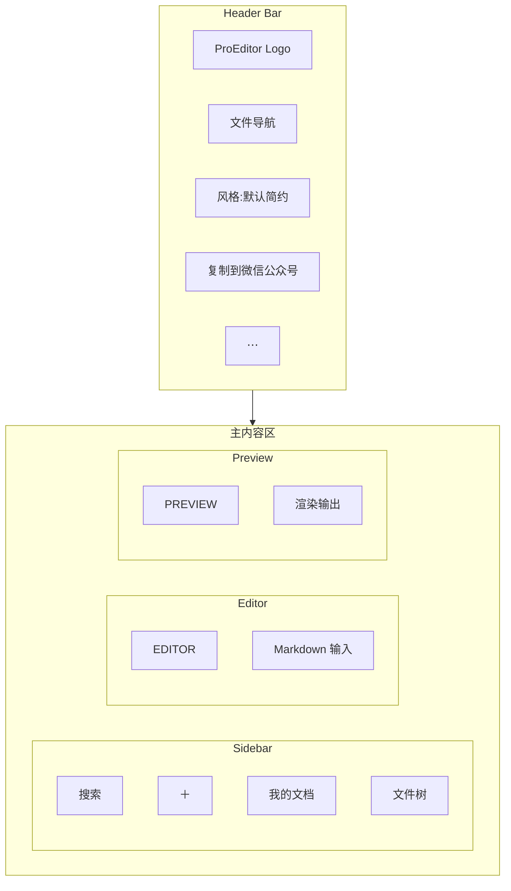

# ProEditor 风格复刻 — 设计系统分析

基于参考图的 ProEditor Markdown 编辑器设计语言提取，目标 80–95% 视觉还原。

---

## 1. 布局分解 (Layout Decomposition)

```json
{
  "layout_type": "split",
  "structure": "header + sidebar | editor | preview",
  "max_width": "100%",
  "grid_system": "三列垂直分割",
  "section_spacing": "1px 分隔线",
  "sections": [
    "Header Bar（顶部横条，跨 editor + preview）",
    "Left Sidebar（约 20–25% 宽）",
    "Editor Pane（约 35–40%）",
    "Preview Pane（约 35–40%）"
  ]
}
```



---

## 2. Design Tokens（官方导出）

### 2.1 核心色彩 (Colors)

**品牌色 (Brand)**

| Token | 值 | 用途 |
|-------|-----|------|
| `--color-brand-primary` | `#4F46E5` | Logo、激活状态、主要交互 |
| `--color-brand-success` | `#07C160` | 「复制到微信公众号」按钮 |

**基础色彩 (Neutral)**

| Token | 浅色 | 深色 | 用途 |
|-------|------|------|------|
| `--color-surface-base` | `#F8FAFC` (Slate-50) | `#0F172A` (Slate-900) | 页面大背景 |
| `--color-surface-elevated` | `#FFFFFF` | `#1E293B` (Slate-800) | 侧边栏、面板、下拉菜单 |
| `--color-border-subtle` | `#E2E8F0` (Slate-200) | `#1E293B` (Slate-800) | 边框、分割线 |
| `--color-text-primary` | `#1E293B` (Slate-800) | `#F1F5F9` (Slate-100) | 标题、正文 |
| `--color-text-muted` | `#64748B` (Slate-500) | `#94A3B8` (Slate-400) | 次要文本、辅助说明 |

### 2.2 间距 (Spacing)

4px 为基础步进系统。

| Token | 值 | 用途 |
|-------|-----|------|
| `--space-xs` | 4px | 小元素间距、图标间距 |
| `--space-s` | 8px | 列表项内边距、元素组间距 |
| `--space-m` | 16px | 容器内边距、卡片内边距 |
| `--space-l` | 24px | 区块间距、头部间距 |
| `--space-xl` | 40px | 预览区侧边距、大排版间距 |

### 2.3 圆角 (Radius)

| Token | 值 | 用途 |
|-------|-----|------|
| `--radius-s` | 4px | 小按钮、输入框 |
| `--radius-m` | 8px | 主要按钮、下拉菜单选项 |
| `--radius-l` | 12px | 面板、浮动容器 |
| `--radius-xl` | 16px | 代码块背景、图片容器 |

### 2.4 阴影 (Shadows)

| Token | 值 |
|-------|-----|
| `--shadow-soft` | `0 1px 3px 0 rgba(0,0,0,0.1), 0 1px 2px -1px rgba(0,0,0,0.1)` |
| `--shadow-medium` | `0 10px 15px -3px rgba(0,0,0,0.1), 0 4px 6px -4px rgba(0,0,0,0.1)` |
| `--shadow-brand` | `0 10px 15px -3px rgba(79,70,229,0.2)` |

### 2.5 字体排版 (Typography)

| Token | 值 |
|-------|-----|
| `--font-sans` | Inter, system-ui, -apple-system, sans-serif |
| `--font-mono` | 'JetBrains Mono', 'Fira Code', monospace |
| `--font-serif` | Georgia, serif |

**字号层级**

| Token | 值 | 用途 |
|-------|-----|------|
| `--text-display` | 30px / 1.2 | 粗体 |
| `--text-heading` | 20px / 1.4 | 半粗体 |
| `--text-body` | 14px / 1.6 | 常规 |
| `--text-caption` | 12px / 1.5 | 中等粗细、全大写或加宽字间距 |

### 2.6 交互状态 (Interactions)

| 状态 | 说明 |
|------|------|
| Hover | 背景色降低 10% 明度，或增加 ring 效果 |
| Active | `scale(0.95)` 缩放反馈 |
| Transition | `all 300ms cubic-bezier(0.4, 0, 0.2, 1)` |

---

## 3. 组件系统 (Component System)

| 组件 | 样式要点 |
|------|----------|
| **Header** | Surface-Elevated、底部分隔线、左右布局 |
| **主按钮** | Success `#07C160`、白字、Radius-M、Shadow-Brand |
| **下拉按钮** | Surface-Elevated、Border-Subtle、Radius-M |
| **侧边栏选中** | Primary 淡色背景、Primary 文字 `#4F46E5` |
| **加号按钮** | Success 绿色圆形 `#07C160` |
| **代码块** | 深色背景、Radius-XL、Shadow-Medium |
| **行内代码** | 浅色背景、Primary 或强调色 |
| **面板标题** | Caption 字号、Text-Muted、全大写 |

---

## 4. 实现层级

```
design-tokens.css → 定义 CSS 变量
       ↓
styles.css → 应用变量到组件
       ↓
组件 → 使用 class，无需改 JSX
```

---

## 5. 保真度 (Fidelity Level)

| 级别 | 说明 |
|------|------|
| **Medium** | 色彩、字体、间距、圆角对齐；布局保持现有结构 |
| **High** | 可增加 Header、文件导航等；需改 JSX |

当前实现目标：**Medium** — 不改布局，仅替换设计语言。
