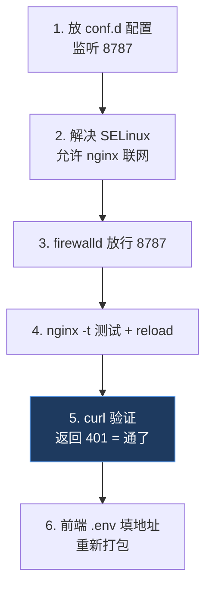

# CentOS + Nginx 部署 Notion 反代（HTTP 版）

用 Nginx 直接反向代理转发 Notion API，**不跑额外 Node 进程**。适用于 CentOS / RHEL。

> ⚠️ HTTP 下 Notion token 会**明文走网络**。自用且在可信网络里可接受；长期用建议加域名上 HTTPS（见末尾）。

整体流程：



## 1. 放配置文件

CentOS 的 Nginx 主配置默认 `include /etc/nginx/conf.d/*.conf`，所以放这里即可：

```bash
sudo tee /etc/nginx/conf.d/notion-proxy.conf > /dev/null <<'EOF'
server {
    listen 8787;
    server_name _;

    location /v1/ {
        # 预检请求直接返回
        if ($request_method = OPTIONS) {
            add_header Access-Control-Allow-Origin *;
            add_header Access-Control-Allow-Methods "GET,POST,PATCH,DELETE,OPTIONS";
            add_header Access-Control-Allow-Headers "Authorization,Notion-Version,Content-Type";
            add_header Access-Control-Max-Age 86400;
            return 204;
        }

        add_header Access-Control-Allow-Origin * always;
        add_header Access-Control-Allow-Headers "Authorization,Notion-Version,Content-Type" always;

        proxy_pass https://api.notion.com/v1/;
        proxy_ssl_server_name on;
        proxy_set_header Host api.notion.com;
    }
}
EOF
```

单独监听 8787，不干扰现有 80 端口站点。前端基地址将是 `http://你的IP:8787/v1`。

## 2. 解决 SELinux（CentOS 必做，最容易卡）

CentOS 默认开 SELinux，会**拦截 Nginx 主动向外联网**（连 api.notion.com），不处理 curl 会返回 502。先看状态：

```bash
getenforce        # Enforcing = 开着，需要下面这步；Disabled/Permissive 可跳过
```

允许 Nginx 联网（`-P` 永久生效）：

```bash
sudo setsebool -P httpd_can_network_connect 1
```

## 3. firewalld 放行端口

CentOS 用 firewalld（不是 ufw）：

```bash
sudo firewall-cmd --permanent --add-port=8787/tcp
sudo firewall-cmd --reload
```

> 如果服务器在云上（阿里云/腾讯云等），还要去**云控制台的安全组**放行 8787 端口，否则外网照样连不上。

## 4. 测试配置并重载

```bash
sudo nginx -t                  # 必须看到 syntax is ok / test is successful
sudo systemctl reload nginx
```

## 5. 验证代理通不通

不带 token 应返回 **401**（Notion 说缺授权），这正说明转发通了：

```bash
curl -i http://你的IP:8787/v1/users/me
```

- 看到 `HTTP/1.1 401` + `Access-Control-Allow-Origin: *` → ✅ 成功
- `502 Bad Gateway` → 多半是 SELinux 没放行（回到第 2 步），或看日志 `sudo tail /var/log/nginx/error.log`
- 连接超时 → 防火墙 / 云安全组没放行 8787（第 3 步）

## 6. 前端配地址并打包

在项目 `apps/editor/` 下：

```bash
cp .env.example .env
# 编辑 .env：
# VITE_NOTION_PROXY=http://你的IP:8787/v1
```

然后重新 `pnpm electron:build`。打包后的 app 里 Notion 面板就不再灰了。

---

## 可选：升级到 HTTPS（强烈建议长期用）

token 明文走网络有风险。有域名的话，加 HTTPS 很简单：

```bash
sudo yum install -y certbot python3-certbot-nginx
sudo certbot --nginx -d your-domain.com
```

certbot 会自动改 Nginx 配置并续期。之后前端地址改成 `https://your-domain.com:8787/v1`（或把 listen 改成标准 443 + 一个路径前缀）。需要时找我帮你调。
